## 出走受付

前日の午前11時に出走受付がありました。
車検などは特にないようでした。
そもそも、前日に風邪をひいてしまって、あまり自転車に乗る元気はなく、タクシーで行ったので自転車は持って行ってませんでしたが。

集合場所は主催者の自宅兼仕事場でした。
表にはSILK ROUTE 1200kmのかっこいいのぼりが出ていました。

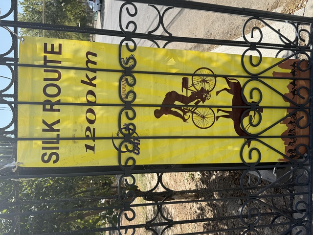

家に入ると中庭があり、たくさんの人が集まるのにも十分でした。

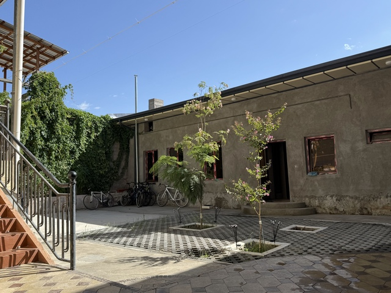

ブルベカード。
なかなかのかっこいいデザインです。

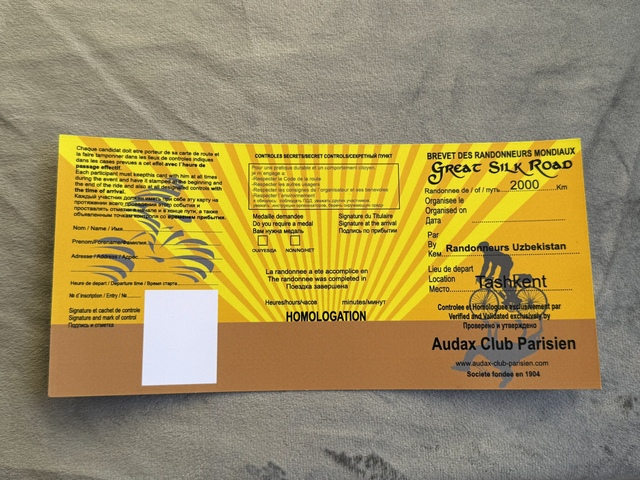

裏側はこんな感じです。
2000kmも走るのに、チェックポイントが6ヶ所しかありません。

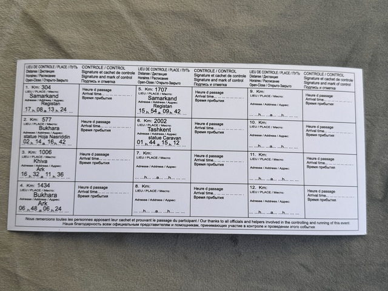

ま、そもそも、曲がる箇所がほとんどないのでチェックポイントを作る必要さえありません。

折りたたむとこんな感じ。

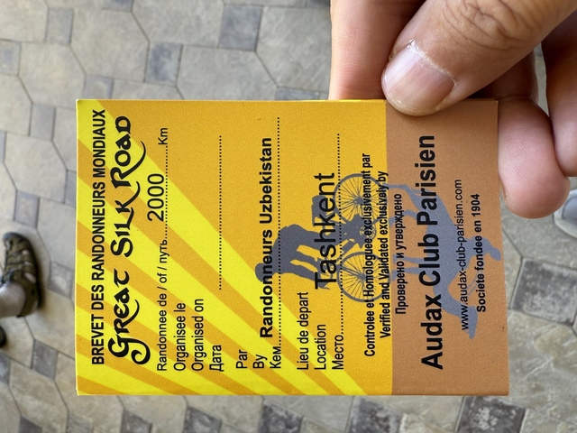

受付の様子。

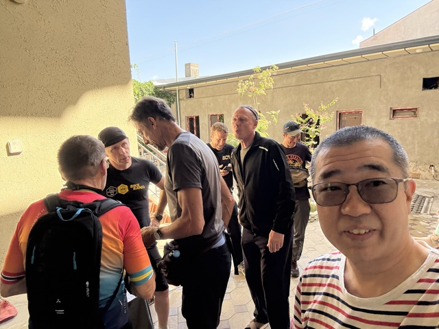

2000kmの参加者と1200km参加者が混在しています。
これで全員ではないようなので、ゆるい感じです。
2000の方はロシアからの参加者がほとんどで、他にはドイツ、トルコ、カナダから来ていました。

英語を話せるOlegさん。助かります。

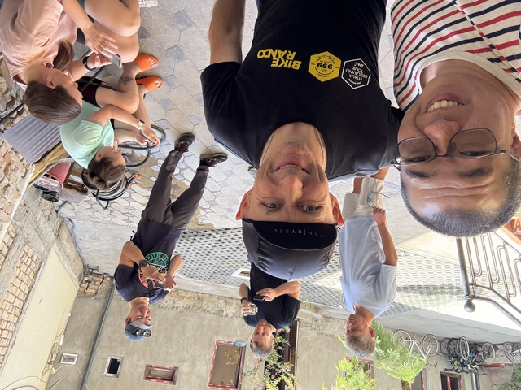

主催者の家の自転車

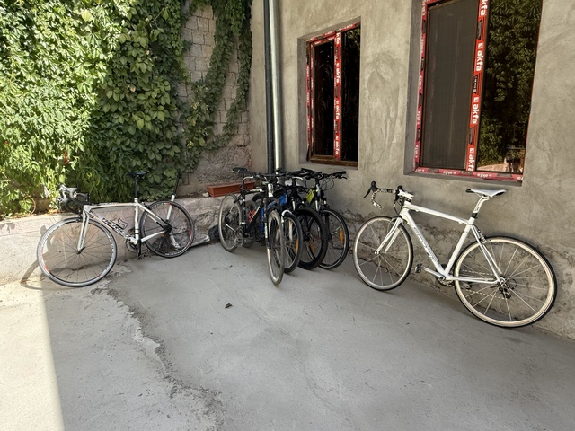

読めないですが、1200ですね。

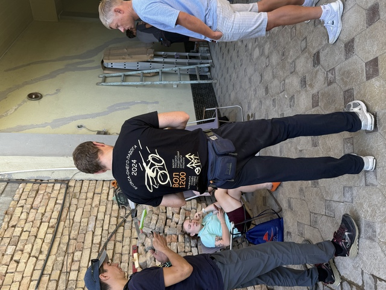

明日から一緒にがんばって楽しみましょう。

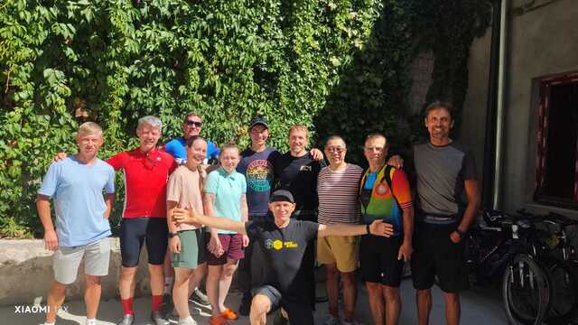

この後、ロシアのチームの人たちとプロフを食べに行きました。

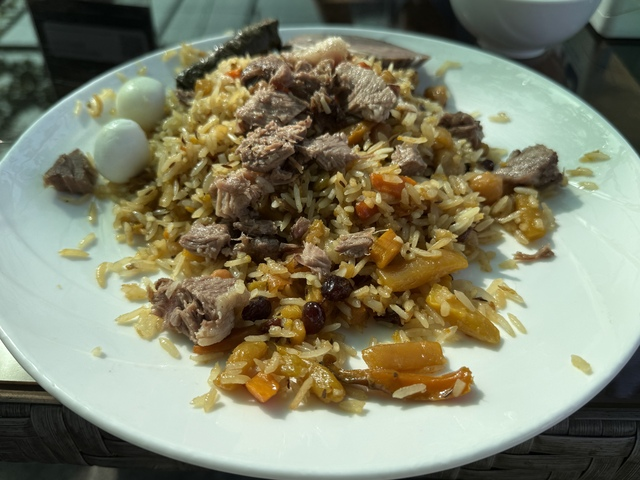
