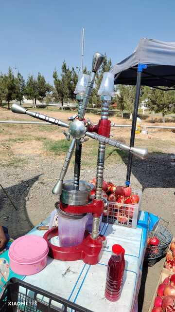
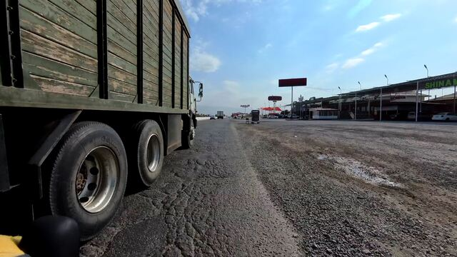
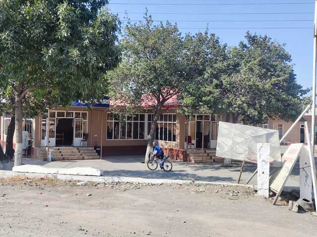
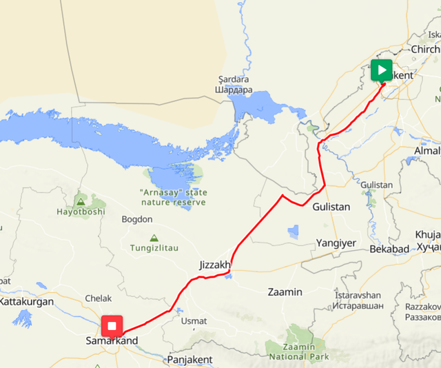
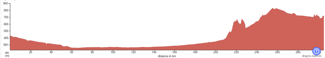

## スタート地点

スタートはこのキャラバンの像がある公園です。

公園に行くと2人自転車の人たちがいました。

参加者だと思ったのですが、ただ単にサイクリングに来たのか応援に来たのか、参加者ではありませんでした。

参加者もぼちぼち集まってきました。

さっきのおじさん、すごく陽気な人で集合写真も撮ってくれました。
一番左の人は参加者ではないので、ここでは2000km, 1200km合わせて7人です。

暖かくなってきたのでジャージは半袖に替えました。

おじさん自撮りバージョン
お友達の顔隠れてますよ！

参加者の自転車です。意外と荷物は少なめのようです。

出発するときには11人になっていました。
2000だけでも23人の参加者がいたはずなのですが、ほとんどはDNSのようです。実際に2000に参加したのは、6人だけでした。

さて、いよいよ出発です。
2000kmの旅の始まりです。

## スタート(タシケント)～CP1(サマルカンド): 304km

スタート地点に集まった11人で出発します。

しばらくは、下り基調で28km/hくらいのペースで話しながらゆったり進みます。

このあたりの道路は路面もよく走りやすいですが、路肩がほとんどないのでひとりでは走りにくそうです。



しばらく行くと路面がひどくなりました。



全体的にひどい路面が多く、きれいなところは一部だけだったようです。

しばらく進むと田舎の風景になりました。

周りは木だけになってきました。

しばらく行くと小さな町に入りました。
なかなかのカオスです。



めちゃめちゃでかいタイヤがありました。

Sirdaryoという街まで来ました。

スタートからだいたい80km、このあたりに、主催者お勧めのレストランがあるはずです。

みなさん、吸い込まれるように入っていきます。

何を頼むといいのかよくわからないので、お任せしていると、こんな感じで出てきました。

これは、リモンチャイ、レモンティーです。
急須にはレモンが1つまるごと入っていて、砂糖もたっぷりで疲れた体にはしみる飲み物でした。

これは、なんか付いてきたスープ。

左奥はトマトのサラダ、右奥は、別注文のスープ、下は羊の肉を人管サイズに切って小さな竹串に刺して焼いたものでした。

でっかいシャシリクより柔らかくて食べやすいので気に入りました。
ChupChakと言うと教えてもらったので、その後何回か聞いてみましたが、うまく通じず、この料理を食べたのはここが最初で最後でした。

後ろはロシアチーム。
女性の二人は1200です。
他の男性陣はたぶん先に行ってしまいました。

危険そうな付け合わせも出てきました。

食堂を出てしばらく行くと、ザクロが売られていました。
ジュースにしてくれて飲めるようなので、さっそく寄ります。

機械で絞りたてを売っています。

こんな感じの生搾りザクロです。

いただきます！

味が濃いので、半分くらい飲んで残りは背中に挿して進みました。

電柱の上のコウノトリを見ながら進んでいると、スタートから120kmほど。
そろそろ最終日のホテルがあるあたりに近づいてきました。
一旦集団から離れてホテルを探してみることにします。

地図では奥まったところにあったので少し迷いましたが、大通り沿いにありました。

中に入って聞いてみるとちょうど英語ができる若い女性がいて情報を収集しました。
チェックインは24時までやってるそうで、最終日はここを目指してもよさそうです。
予約などはやってなさそうだったので、また来週来るかもとだけ言い残してルートに戻りました。

タシケントでのホテルの適当さから考えても予約などできたとしてもおそらく無駄でしょう。

道路の向かい側にもレストラン兼ホテルがありました。

ルートに戻ってしばらく一人で走っていると、お店にみんな集まっていました。
飲み物を買って合流することにします。

トイレに行ったりしていると、ここを管理しているっぽい人が写真を撮ろうと言い出します。

この後、道中いろんな人と写真をすることになるのですが、不思議です。

Jizzax(ジザフ)というところにやって来ました。

大きな街なのですが、この幹線道路からは少し離れています。
昔ソ連時代に競合のサッカーチームがあったらしく、モスクワまで試合に来て優勝していた、というような話を聞きました。
ロシアの人たちにとって懐かしいサッカーチームの街という感じでした。

反対側の道路の向こうはタジキスタンだそうです。
地図を見るとだいぶ離れてる気がしますが。

ときどき、道路工事で片側の対面通行になっているところがあります。
ただでさえ狭い路肩の道路が対面通行になるので、かなり怖くて神経を使います。



工事の終わったところの路面はきれいです。

このあたりでOlegとマーシャの3人になったので、Olegと二人で5km交代で回します。

道路が荒れてるところに限って、トラックがギリギリを攻めてくるのでなかなか怖いです。

ここから西に向かいます。
奥に少し山なみが見えてきました。

約207km。オススメの食堂があるので寄ります。

時刻は午後4時頃なので207kmを9時間ほどです。
だいぶ速いペースです。
このまま行けば、サマルカンドには23時ごろまでには着けそうです。

とりあえず、プロフとリモンチャイをいただきます。

こんな感じで急須にレモンがまるまる入っています。

団らんの様子です。

ロシア組は一足先に出発するそうです。
Olegは僕より3日早く完走する予定なので、今夜はサマルカンドで泊まって明日は朝3時に出発して270kmのブハラより更に先まで行くそうです。
残りの2人は1200なので明日のブハラまでの行程が340kmほどあります。

僕の予定は朝6時に出発してのんびりブハラまで行く予定です。
そんな話をしていると、オレンジのRuslanがOlegに着いていくほど速くないので、僕のプランに便乗するそうです。

とりあえず、この皮算用を共有してあげて、明日朝6時に集合して一緒に行くことにしました。
彼は英語は話せませんが、現地の人がいると頼もしそうです。

ということで、Ruslanはまだご飯中なので、先にひとりで出発することにします。

サマルカンドまで、残り97kmです。

しばらく進むと、まわりがすっかり砂漠になりました。
なるほど。あの食堂がお勧めだったわけですね。

ここからはいくつかアップダウンがあります。
最高地点は800mくらいまで登ります。

写真ではなかなか伝わらないですが、起伏のある砂漠の風景は圧巻です。

途中ガソリンか何かを売ってる人がたくさんいました。

HAMKOR BANK。突然銀行の看板が現れます。
さすがに銀行はないと思うので、なにか宣伝なのでしょうか。

だんだん陽も沈んできてきれいです。
後ろのRuslanが通る頃にはきれいに夕日かも知れません。

楽しそうにしています。

砂漠を過ぎて下りきると、町が出てきました。
ここからサマルカンドまではもう砂漠はありません。

とりあえず、水の補給とザクロジュースを飲んでいると、

またまた、来ました、話しかけてきて写真を撮る人たちです。

Google翻訳と身振り手振りと固有名詞でしか会話ができないので、ウズベク語が話せると楽しいんだろうなぁと思います。

なんか動物が横断していきました。

21時になりました。
宿に着くのは10時半か11時頃なので、夕食を食べることにします。

こんな感じのレストランです。
ここに座ってるおじさんももちろん?!後で話しかけに来ました。

少し肌寒かったので、スープとシャシリクを頼みました。
スープは肉や野菜がたっぷり入っていて、そこそこのボリュームがあります。

こちらはシャシリクです。
日本の焼き肉食べ放題だと大量に食べるのですが、なぜかこれは2本くらいでお腹いっぱいになってしまいます。

食事をしているとどんどん寒くなってきました。
外の席と中の席があるので中にした方がよかったかもしれません。

出発前には歯がガタガタするほど寒かったので、暖かいジャージに着替えました。
汗冷えのせいか、風邪のせいか、風邪薬のせいか、ま、着替えたら暖かくなったので大丈夫です。

しばらく進むと、サマルカンドのきれいな電飾が出てきました。
サマルカンドももうすぐです。

道路の先に街明かりが見えます。
あのあたりがサマルカンドでしょうか。

街に入ると信号待ちもありました。
止まっていると、トラックの運転手が窓から身を乗り出して話しかけてきました。
よく分からなかったのですが、三角の反射おにぎりが後ろからよく見えたらしく、気に入っているようでした。
ほんと、いろんな人から話しかけられる国です。

細い路地を抜けると今日の目的地はもうすぐです。

じじゃーん、ついにサマルカンド到着です。

通過チェック用の自撮りをしてTelegramに送ります。
22:37の通過です。

先に出発したOlag達3人は1時間前に着いたようです。
速いですね。
さらに先に行ってた他の3人は19:30くらいに着いたみたいです。
300kmを12時間半。めちゃ速いですね。

階段を下に降りてみます。

ドイツからの観光客の人が撮ってくれました。

なんと、この方も自転車に乗るそうで、さっそくStravaのフレンドとなりました。

宿はチェックポイントのすぐ側でしたが、手続きに時間がかかったので、寝たのは23:30でした。
目覚ましをを5:15に合わせて、明日は6:00からRuslanと一緒にブハラに向けて出発です。

おやすみなさい。

1日目: 移動距離: 304km

