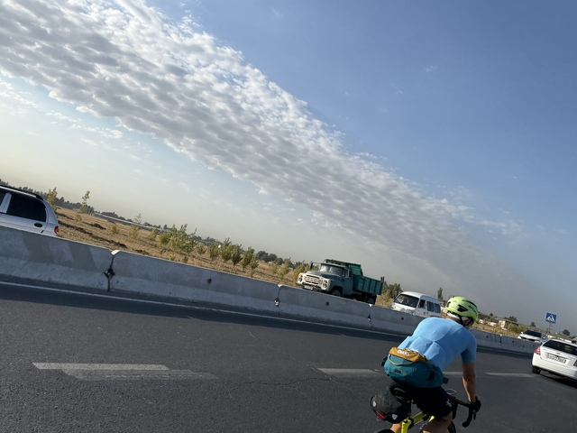
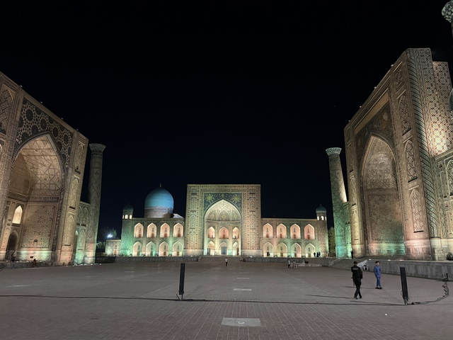

## スタート地点

スタートはこのキャラバンの像がある公園です。

公園に行くと2人自転車の人たちがいました。

参加者だと思ったのですが、ただ単にサイクリングに来たのか応援に来たのか、参加者ではありませんでした。

参加者もぼちぼち集まってきました。

さっきのおじさん、すごく陽気な人で集合写真も撮ってくれました。
一番左の人は参加者ではないので、ここでは2000km, 1200km合わせて7人です。

暖かくなってきたのでジャージは半袖に替えました。

おじさん自撮りバージョン
お友達の顔隠れてますよ！

参加者の自転車です。意外と荷物は少なめのようです。

出発するときには11人になっていました。
2000だけでも23人の参加者がいたはずなのですが、ほとんどはDNSのようです。実際に2000に参加したのは、6人だけでした。

さて、いよいよ出発しました。
2000kmの旅の始まりです。

## スタート(タシケント)～CP1(サマルカンド): 304km

1日目: 移動距離: 304km
