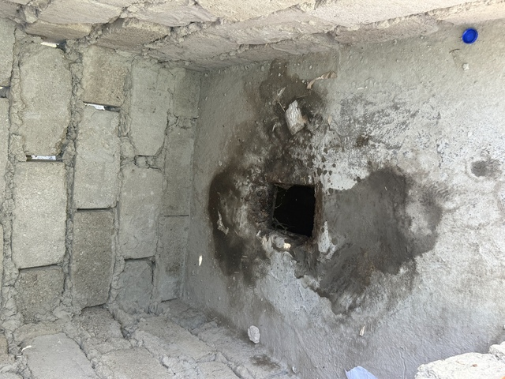

## CP1(サマルカンド): 304km ～ CP2(ブハラ): 570km

さて、2日目です。
予定通り5時15分に起きて、6時に待ち合わせるためにRuslanのTelegramを確認します。

なんと、サマルカンドに到着したのが2時過ぎになってしまったので、朝出発するのはやめるそうです。
ゆっくり遅く出発するのでしょうか。
それとも、このままDNFするということなのでしょうか。

ロシアチームは3時頃出発してブハラの先まで行くと言ってたので、おそらく会うことはないでしょう。
ここからは、ひとりでのんびり進むことにします。

風邪の方もすっかり気にならないレベルになったようです。

ホテルの朝食が8時からなのでお弁当を用意してくれていました。

朝6時のサマルカンドです。
夜は人が多いので、この時間に観光するのは狙い目かもしれません。

とりあえず、1日でタイヤの空気がどのくらい減ってる確認して調整して出発しようと思います。

バルブをプシュっとすると、おっと、シーラントが吹き出してきました。
バルブを上にして作業したのですが、ちょっと失敗したようです。
空気を入れようとしても、入らないので、一旦、バルブコアを抜いて少し掃除しました。
バルブコアを外すために空気を抜く時、ビードのところから少しシーラントが出てきて、ほんとドキドキでしたが、この後問題はありませんでした。
バルブコアの予備は家に置いてきてしまったので、これでなんとか最後までしのぎます。
電動ポンプではちょっと空気を送って、バルブコアが詰まってるので規定空気圧になったと勘違いして止まり、数秒後に本当の空気圧に表示が下がる、という感じです。
ちょっと入れてを繰り返せば問題なくいけそうです。

さて、気を取り直して出発しましょう。

牛か何かがいました。

サマルカンドとブハラの間も舗装路が続きます。

シルクロードの道沿いには綿花畑が広がっています。
ときどき、道路に綿が落ちてたりもします。

しばらくすると、道路がめちゃめちゃ悪くなりました。

このな時は、ガタガタの舗装路を走るのと、横の砂利道を走るのとどっちがいいのでしょうか。

砂利道は砂利道で、深い凹凸がよくあるので、上下にブヨンブヨンとジャンプします。
この時は、空気圧を試行錯誤中でまだ高めだったので、ガタガタ舗装路はかなり辛かったです。

9時頃になったので、朝食にしました。

サモサです。

中はこんな感じです。

おいしかったので2つ食べました。

ここでも、また、店にいた人たちが気さくに話しかけてきます。

自転車にも興味津々でいろいろ聞いてきました。

乗ってみたいというので、貸してあげたら、少し走ったところでブレーキが分からずびっくりしてました。
ブレーキは最初に教えてあげないとですね。

トイレです。
トイレは、建物の外に別にある場合がほとんどでした。

ここのトイレは中は、穴が開いてるだけでした。

看板にブハラ(Boxoro)の文字が入るようになってきました。

シルクロード沿いには、よくキャラバンの像があります。

12時頃飲み物休憩です。

大量の荷物をロバが引いています。

12時半頃417km地点のお勧めのレストランに到着しました。
110kmくらいを6時間です。
下り基調のはずなのですが、道が悪いのでこんなもんでしょう。

小上がりでのんびりします。

ウズベキスタンのサラダの基本はトマトサラダです。

プロフですが、でかいです！

めちゃめちゃでかいです。

肉も大きいので、ナイフで切って食べます。

しっかり食べたのですが、今日はなかなか速度が上がりません。

しばらく走ると、少し大きな街ナヴォイを通過します。
ここには空港もあります。

路面もここはいいようです。

何かの建物もありました。

しばらく行くと、またまた、酷い道になりました。
もう嫌です。

ドライブインのようにところがあったので寄ってみました。

ここで、止まって気付いたのですが、後ろのブレーキパッドが強く当たってる場所があります。
どこかでローターを曲げてしまったのでしょうか。
どおりで、速度が出ないわけです。
引きがゆるめになってしまいましたが、当たらないように調整しました。
これで快適になるはずです。

他の人が、食べていたものと同じものを食べてみました。

ヨーグルトのようなものでした。
後でお腹がちょっとゆるくなったので、お通じにはよさそうです。

そろそろ陽も暮れてきました。

西向きに走っているので、夕日がいつもきれいです。

時刻は19時。
ちょうどいいところにお勧めのレストランがありました。

スープとシャシリクを注文します。

サラダなどは注文しなくても勝手に出てきます。
代金は取られるのでGoogle Mapのレビューなどにはロシア人が文句を書いていますが、そういう文化なのでしょう。
いらなければ、いらないと言えばいいと思います。
ヨーグルトのようなものがここでも出てきましたが、さっき食べたばかりなので、これはいらないというと、持っていきました。

ここのトイレはちょっと豪華に、タイのようなホースが付いていました。
この後、ホース付きのトイレは見かけなかったので、豪華な部類のトイレということになります。

ご飯を食べて、しばらく行くと、ブハラの約50km手前、帰りに泊まれたらと期待しているホテルがありました。

まずは、存在が確認できて一安心です。
ホテルのスタッフもいたので、Google翻訳を駆使して交渉します。
22日にまた来るので泊まりたいという話をすると、予約はできないそうです。
いろいろと話をして、パスポートを見せてビザの期限内であることなどを確認すると、ある程度信頼してくれたのか、予約はできないけど、できるだけ空けるようにはしておいてくれるそうです。
10万SUMと20万SUMの2種類の部屋があるそうです。
Agodaから予約した他のホテルと比べるとずいぶん安い価格帯です。

ま、タシケントのホテルが超テキトーだったので、あまり期待はできないのですが、全くの飛び込みよりは全然ましでしょう。

気さくないい奴っぽいです。

このあたりから追い風でブハラまではスムーズに進みました。
ブハラの街の入口です。

街中の道路はきれいです。

CP2に到着しました。

実際にはCP2はこの馬の銅像です。
みんな上に乗って写真を撮って大はしゃぎです。
22:43着です。

ホテルはすぐ近くに予約してありました。

これはホテルの中庭です。

大きなベッドです。
昨日もタシケントも細～いベッドだったので、大きなベッドはうれしい限りです。

部屋も広いです。

途中で買ったパンなど食べて、0時ちょうどに就寝です。
明日から砂漠です。
5時に起きて出発することにします。

おやすみなさい。

2日目: 移動距離: 273km (計 577km)

