## 今日の予定

2日走って577kmまで来ました。
次のチェックポイントは1000km地点なので、ここから420km程あります。
一気にそこまで行くのは遠いので、途中で休みたいと思います。

ここまでの2日は車通りの多い幹線道路でしたが、ここから40km程を過ぎると、300kmくらい砂漠が続きます。
砂漠の区間もGoogle Mapのサテライトで小さなお店やガソリンスタンドは時々あることは確認しています。
50km行けば何かある、というような感じです。
PBPやLELなどでも、チェックポイント間は70kmくらいあったりするので、ものすごく困るということはないと思いますが、不安なので、少しの補給食と水はいつもより多めに持ち運ぶようにしようと思います。

泊まるところですが、Google Mapで事前に840kmあたり(ブハラから263kmくらい)にホテルがあることは確認しました。
ただ、本当に営業しているのか、満室じゃないのかは、行ってみないと分かりません。
もし、泊まれなければ、その先40kmくらいに主催者オススメのレストランがあるので、そこの門を叩くしかないかと思います。
いかんせん、砂漠というものがどういうものなのかもイメージがわかないので、不安がいっぱいですが、走りながら考えようかと思います。

あと、190kmあたりに、復路で泊まりたいレストランがあるので、本当に泊まれるかどうか確認するのも今日の重要なミッションです。

## CP2(ブハラ): 577km ～ 砂漠の中のホテル: 840km

朝、6:10頃、ホテルを出発です。
この時間帯の気温は11度ぐらい。
長袖メリノウールに下は短パンのレーパンに長いタイツを重ねて出発です。

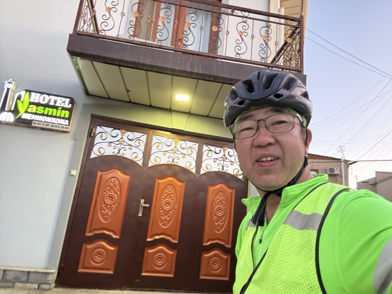

ホテル前の細い路地を走ります。



正面がLyabi Khause広場です。砂漠の中に泉が湧き出しています。



というのを昨日は真っ暗で今朝はすぐ出かけてしまって、これを書いてるときに知ったので見られずに残念でした。

路地を抜けて大通りに出ます。

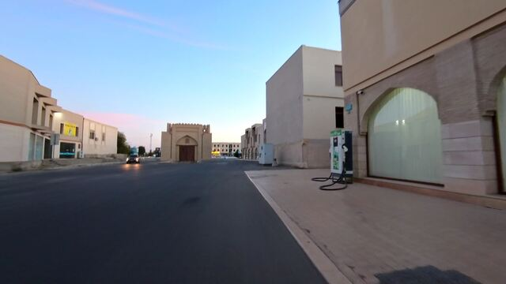

朝の空気が気持ちいいです。
この先、Uターンして北西に進みます。

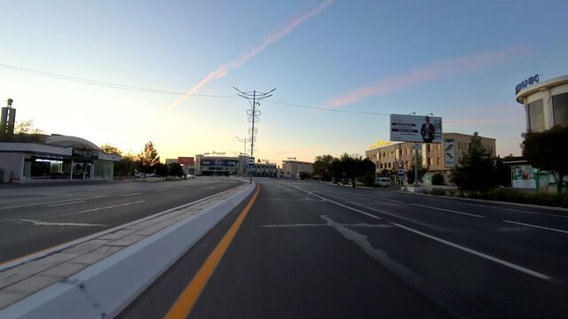

1時間ほど進むと建物も少しずつ少なくなってきました。
食堂のマークがあるので、近くに食堂があることがわかるので便利そうです。
逆に言うと、食堂のマークが必要なほど少ないのかもしれません。

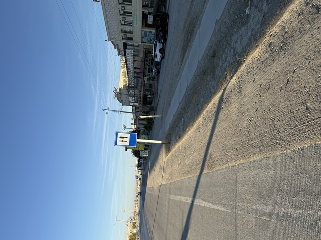

OASISって何でしょうかね。

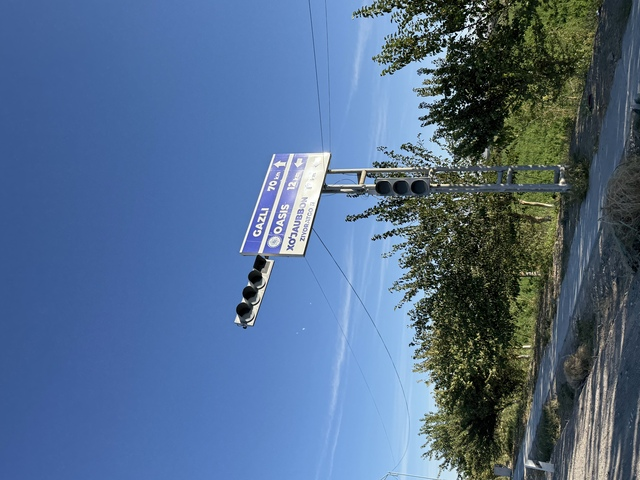

40km程走って、このあたりからお店がぐっと減るので、補給をしておこうと立ち寄ったところ、いきなり自転車が右に傾き、そのまま転んでしまいました。

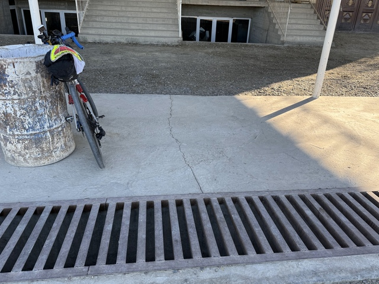

突然で何が起こったのか分からなかったのですが、このグレーチングですね。全然見えてませんでしたよ。
砂利道でもどこでも平気で走れると過信していましたが、これには、35cのタイヤでも勝てませんでした。

しかも、お店は「OPEN」という看板がピカピカしてるにもかかわらず、閉まっていました。

転んだだけ損でしたよ。

少し進むと食堂があったので寄りました。

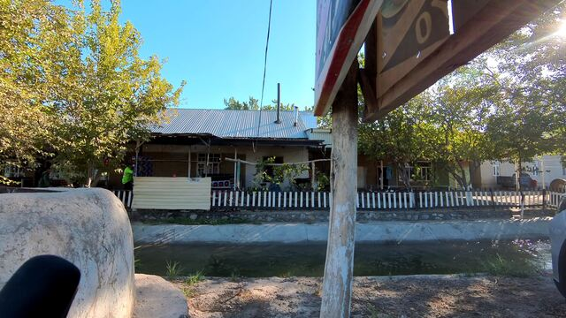

ここを過ぎると次は65kmくらい先のGazliの町のあたりまでは何もなさそうです。

表の看板のメニューはこんな感じです。
一番下のКФС(英語表記ではKFC)がよく見かけて気になっていたのですが、結局滞在中一度も試しませんでした。
鶏の唐揚げをこう呼ぶのでしょうか。
ちなみに、「К」と「K」は別の文字コードです。
ドッペルゲンガードメインみたいでわくわくしますね。

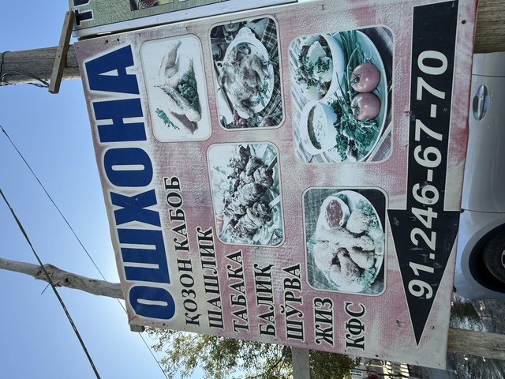

ちなみに、ウズベク語にはアルファベット表記とキリル文字表記があります。
もともとキリル文字が標準だったのが最近はアルファベットで書くようになっているようです。
キリル文字には素養がないので、もはやこうなると看板をみて発音することもできません。

「ОШХОНА」の「ХОНА」は「店」です。
「ОШ」の店ですね。
「ОШ」はご飯です。とくに、プロフのことを「ОШ」と言います。
読み方は、オシホナ? オシハナ? そんな感じです。

中に入って、リモンチャイとシャシリクを注文します。

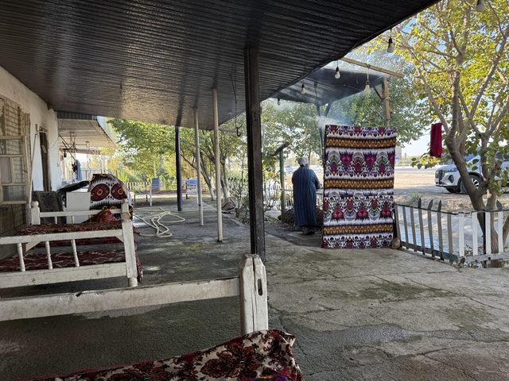

この時、朝8時半くらいなんですが、朝から焼きたての串焼きが食べられるとはいい感じです。

これから焼いてくれます。

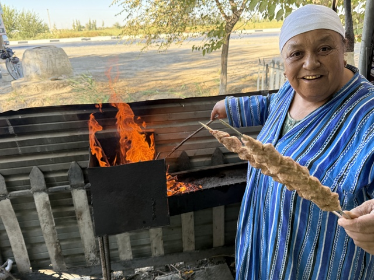

レモンティーでほっこりします。

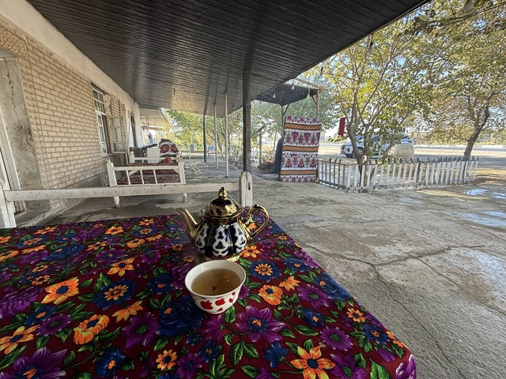

シャシリクとパンが出てきました。

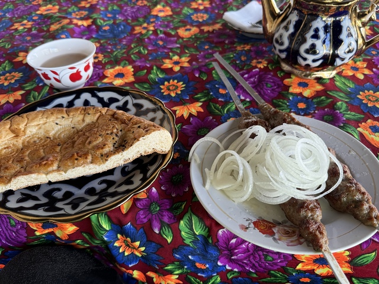

ネコも恨めしそうに見ています。

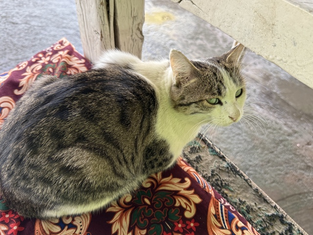

おいしい朝ご飯も食べて出かけると、周りはほとんど何もなくなってきました。

鉄道を高架で越えます。
この少し手前にお店があったので水を補給しておきました。
勝手が分からないので、見つけるたびに満タンにすることにします。

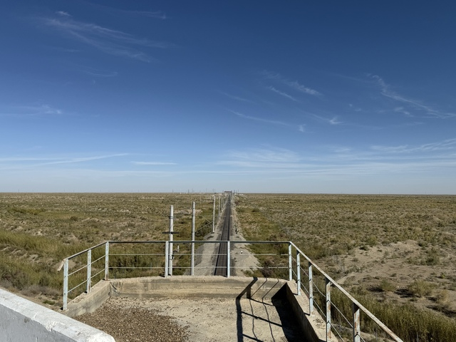

まだ、砂漠という感じではなく、草木は生えています。

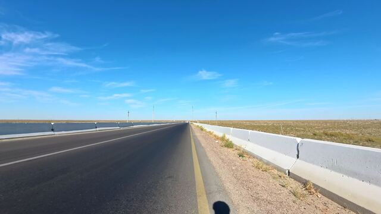

羊がたくさん歩いていました。



まっすぐな道路をひたすら進みます。
暑くなってきたので半袖に着替えです。

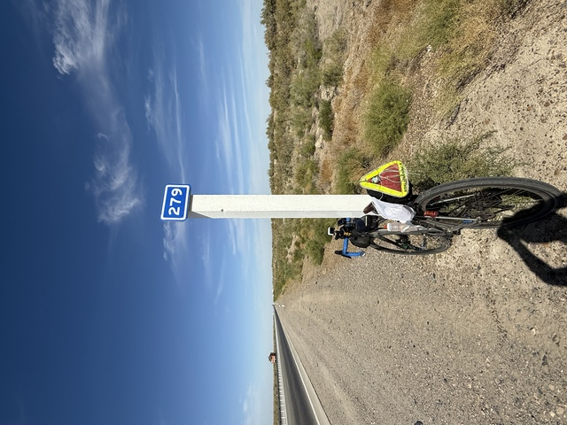

横も地平線まで見えます。

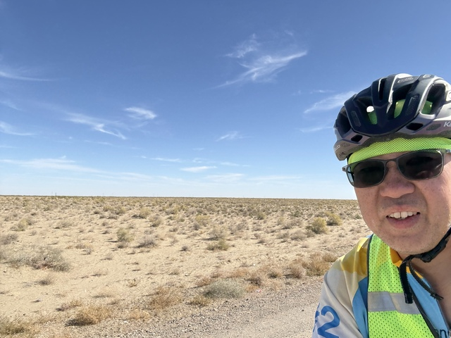

前も後ろもまっすぐです。

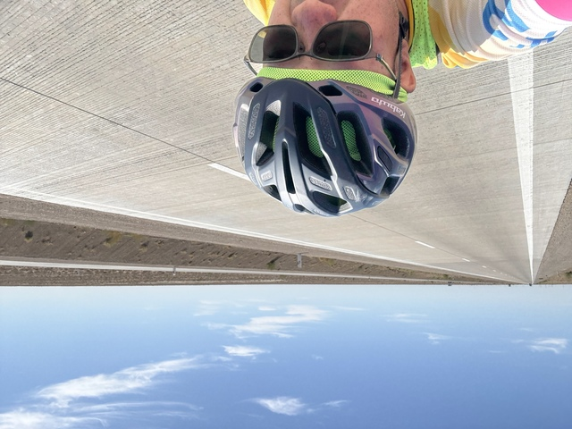

360度なにもありません。



この景色がひたすら続きます。



Google Mapで「Market」と書いてある場所です。
自分の目で見たもの以外はあまり信じすぎないようにするのも重要です。

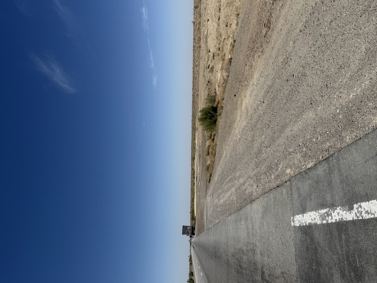

ブハラから102kmくらい、時刻は12時です。
ガソリンスタンドがあったので水を補給します。

奥のガソンリンスタンドの手前にお店があったのですが、気付かず置くまで行くと、おじさんが、ガスを入れるのか?とケタケタ笑いながら話しかけてきました。
ガスじゃなくて水だよぉ、と話すと、いっぱいあるので持っていけ、と大瓶からボトルにたっぷりみずを注いでくれました。

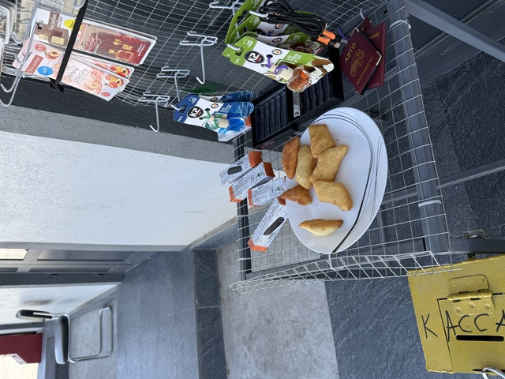

トイレを探していると、お店を見つけたので、ついでにアイスも食べました。
砂漠で食べるアイスはちょーうまうまです。

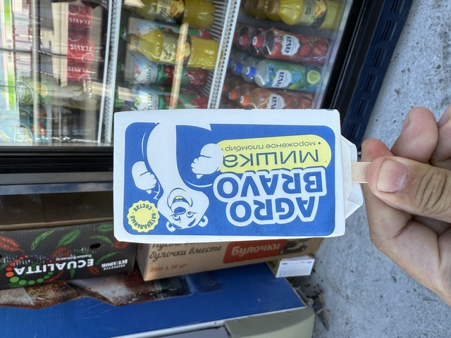

しばらく進むとCAFEがあったので寄ってみます。
この国でCAFEというのは食堂です。

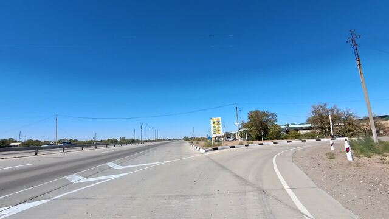

例によって小上がりがあるのでゆったりできます。

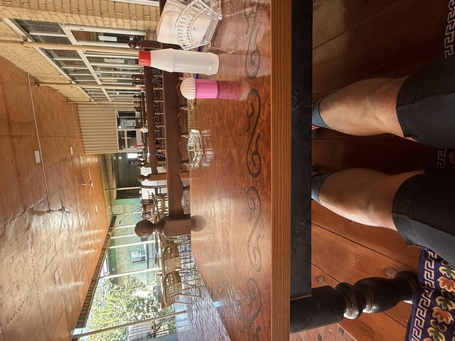

ラグマンをいただきました。
おいしいスープにうどんが入っています。

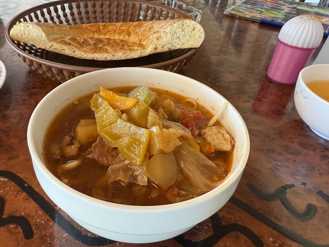

ちょっとうどんを引っ張り出して撮ってみました。

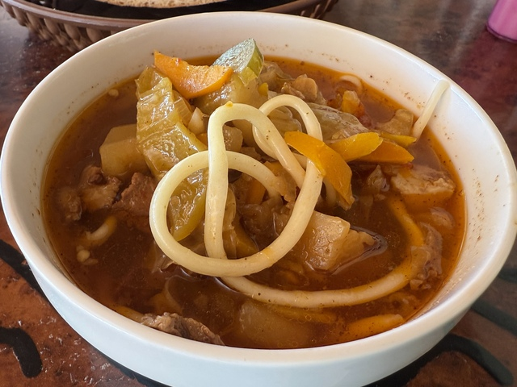

ひたすら砂漠をまっすぐ進みます。



すこし緑も少なくなってきたでしょうか。

何やらオアシスっぽい?看板が出てきました。
あと、400mで何が出てくるのでしょうか。

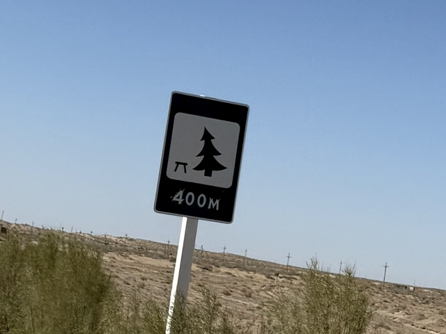

なんか建物がありました。

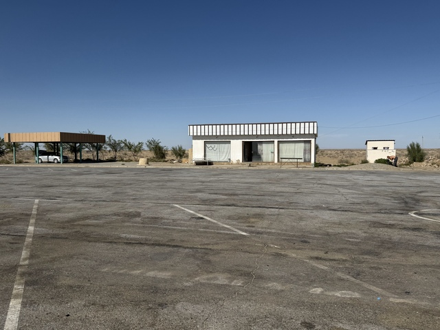

顔を洗っている人がいたので、トイレと水道と仮眠くらいはできるのかもしれません。

時刻は15:20、ブハラから150kmくらいのところで対向車線にお店があったので寄ってみました。



ここも小上がりがあります。

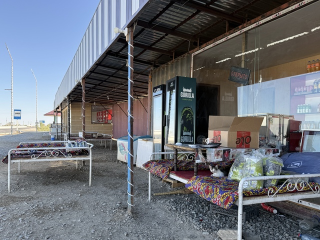

買い物をしていると、ドイツから来たという2人組がやって来ました。
なんと、ドイツから東京まで自転車で旅をしているそうです。
もう、スケールが大きすぎて何を言っているのかよくわかりません。
東京には来年5月か6月に着くらしいです。

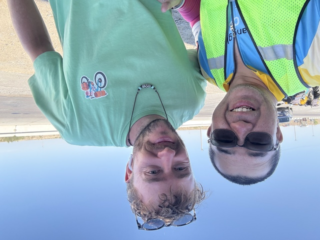

さて、ついでにトイレに行きます。
トイレはだいたい有料で2000スムか3000スム(20円か30円)くらい支払います。
ここでは、紙をもらえました。
ちなみに、紙はたったこれだけです。

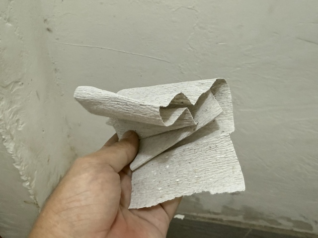

トイレの中や近くにこのようなじょうろが置かれているので、これに水を汲んでお尻をペチャペチャ洗うのが正解のようです。
たまにペットボトルが置いてあるところもありました。
タイもそうですが、ここも左手でお尻を洗う文化圏なのでしょう。
紙は、最後に水を拭くためのものだと思われます。

自転車に乗るときは特にお尻周りは清潔にしたいので、紙よりもこういうふうに水で洗う方が助かります。
よく考えたら、別にPBPやLELでも水を汲んで洗ってもいいのか。

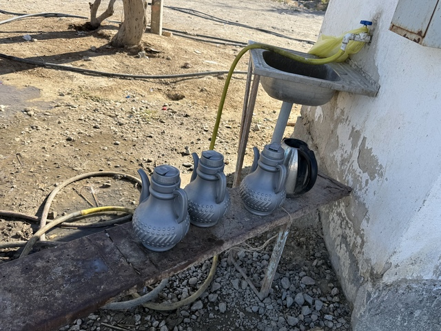

ドイツから日本への自転車旅行中のふたり。

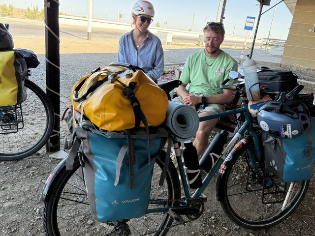

バッグもたくさんです。
昨日は砂漠の中でテントを張ったと言っていました。

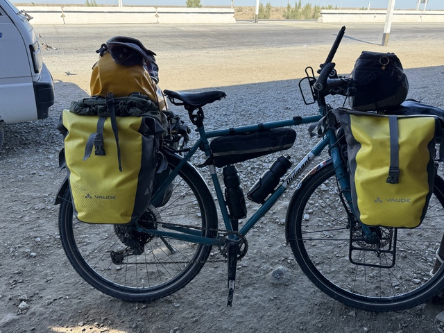

うしろのスプロケもめちゃめちゃでかいです。50くらいありそうですね。

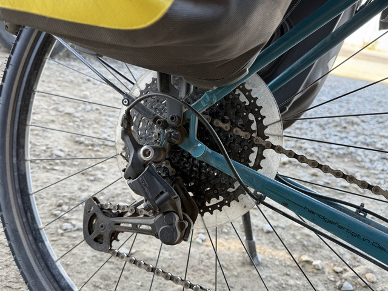

前は、逆にめちゃめちゃ小さいですね。
こんなに歯が尖ってなくても大丈夫なんでしょうか。

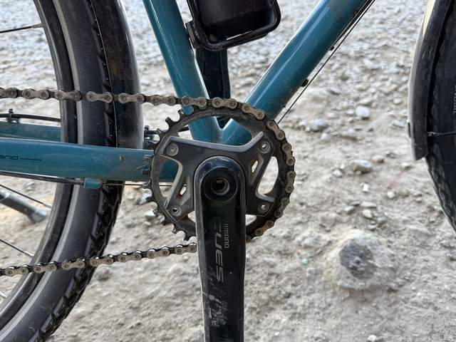

また、しばらく走ると、道なき道を見つけたので、ちょっとだけ走ってみました。



ちょっとわかりにくいですが、タイヤが落ちています。
この砂漠区間で、バーストしたタイヤを数百個は軽く見ました。

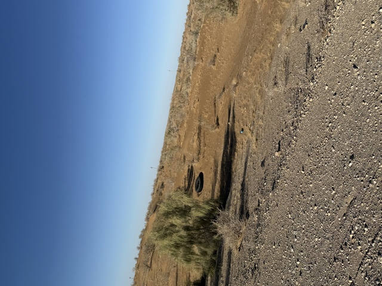

時刻は17:15。とくに代わり映えもしない道をひたすら進みます。



190km地点の、帰りに泊めてもらいたい食堂に到着しました。
17:30、夜ご飯にはいい時間です。

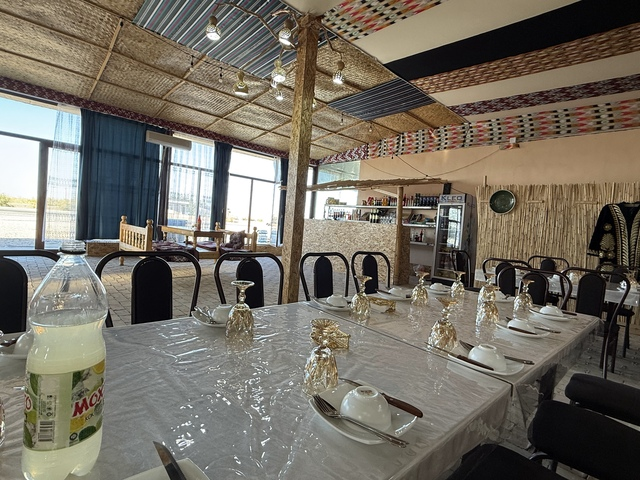

スープとサラダをいただきます。
茄子の天ぷらっぽいものなのですが、サラダと言っていました。

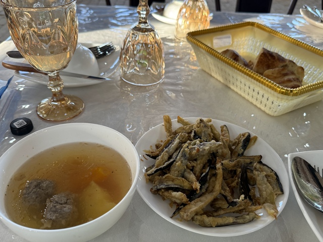

シャシリクもいただきました。

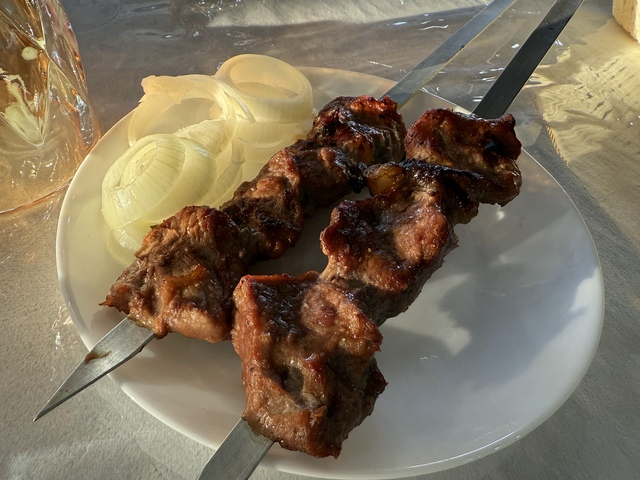

ここも、小上がりがあり、ゆっくり寝たりできそうです。

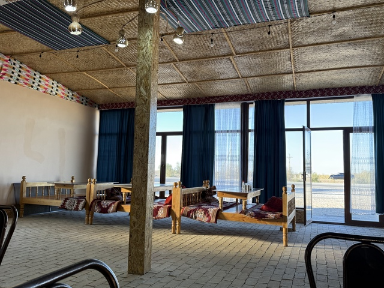

お店の人が英語が話せたので、Xivaまで行って、月曜の夜にまた戻ってくるので、その時に泊めてもらえるか聞いてみました。
特に問題ないそうでした。
これは、助かります。
日本人だと分かると、「おしん」は知ってるか、と聞かれました。
「おしん」は他にも何人か話題にしてたので、こちらでも有名なようです。

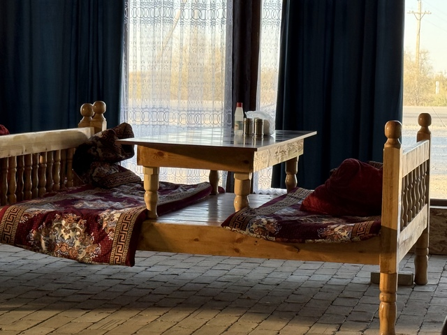

じゃ、月曜の夜10時くらいまでには戻ってくるよ、と伝えてお店を後にしました。

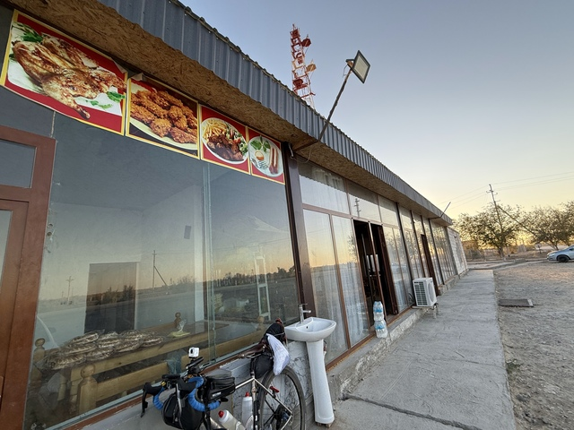

目的のホテルまで、あと、70km程です。
10時半くらいまでには着きたいところです。

しばらく走ると陽が沈み始めました。



西向きに走って、何もない砂漠に沈む夕日は最高に美しかったです。

陽も沈み、真っ暗な砂漠の中をひたすら走ります。
対向車線の車のライトが遙か彼方からゆっくりと近づいてくるのが幻想的です。

そのライトの更に遙か向こうには、何かきらびやかな光が見えています。

食堂から20kmほどのところにその光の正体はありました。
ガソリンスタンドでした。

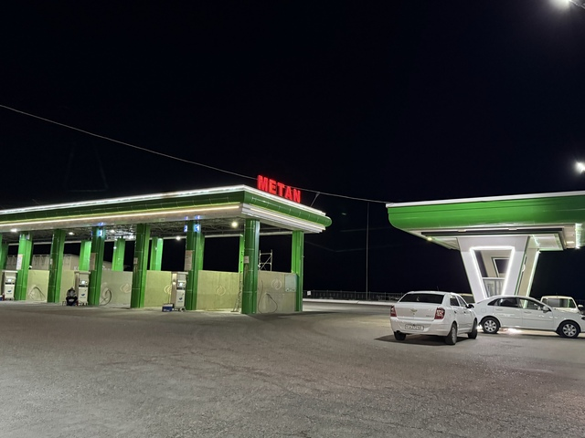

お店もあったので、飲み物を買って休憩しました。

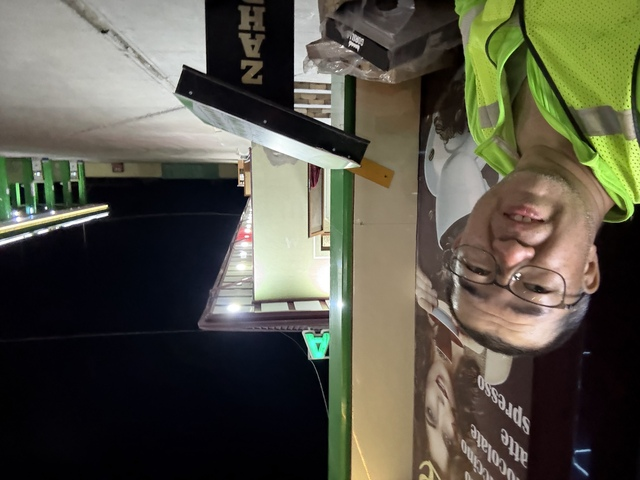

なんか、疲れてますね。

このあたりから、少しアップダウンが出てきました。

さらに、真っ暗な中を25kmほど進むと、また、ガソリンスタンドが出てきたので、トイレ休憩に寄りました。
20:50頃です。

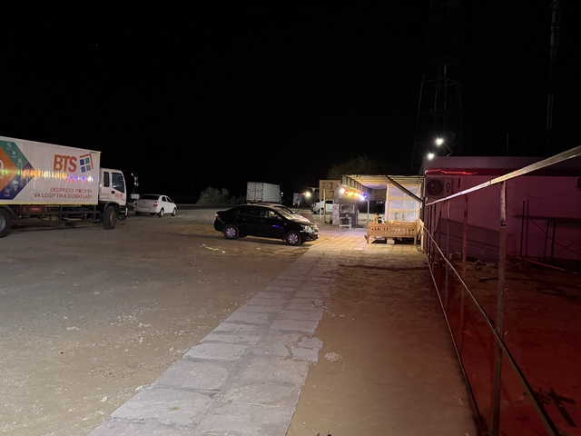

トイレから出てくると、また、物珍しそうにおじさん達が集まってきました。
翻訳アプリと身振り手振りで、今日はどこまで行くのか、というような話をしました。
おじさん達は、これから車でXivaまで行くそうです。
200kmくらいあるので、安全運転で行ってくださいね。

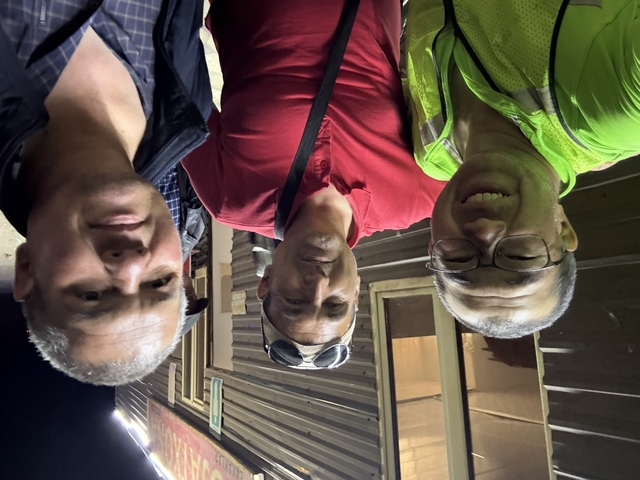

さらに、30kmほど進むと、目的のホテルが見えてきました。
予定通り22時過ぎです。
対向車線側でガードレールの向こうなのですが、少し先にUターンできるところがありそうだったのでそこまで行ってUターンして向かいます。

ホテルに着くと、外に何人かいたので、泊まりたいんだけど、と話をしてみました。
どうやら泊まってる人たちらしく、オーナーは帰って明日にならないと来ないから電話して呼び出してみる、とのことで、電話してくれました。

いやーーー、助かります。
誰もいなかったら危ないところでした。
ちなみに、携帯は圏外だったので、ドアに電話番号があっても僕には無意味です。

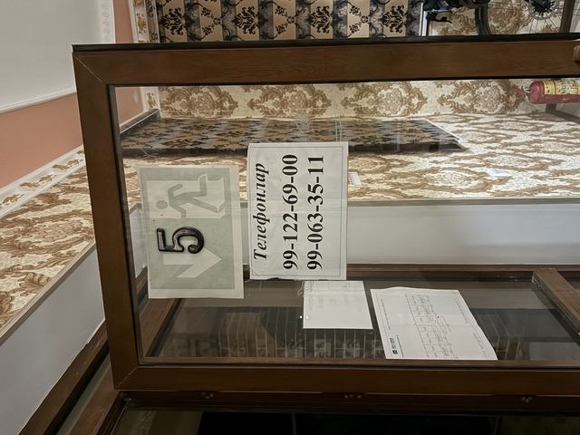

自転車も中に置かせてもらって、しばらくオーナーを待ちます。

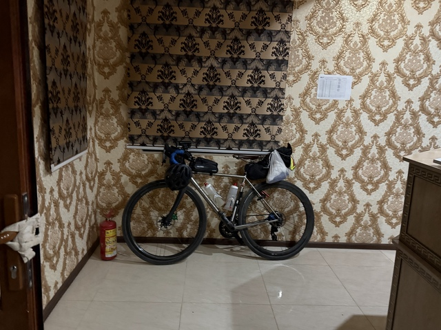

10分程してオーナーが現れました。
お金を払って、部屋に通してもらいます。
部屋は、6人のドミトリーで、泊まってる人たちは同じ職場の仲間という感じでした。
交通整備か道路工事の人たちがまとまってこのホテルに泊まっているようでした。

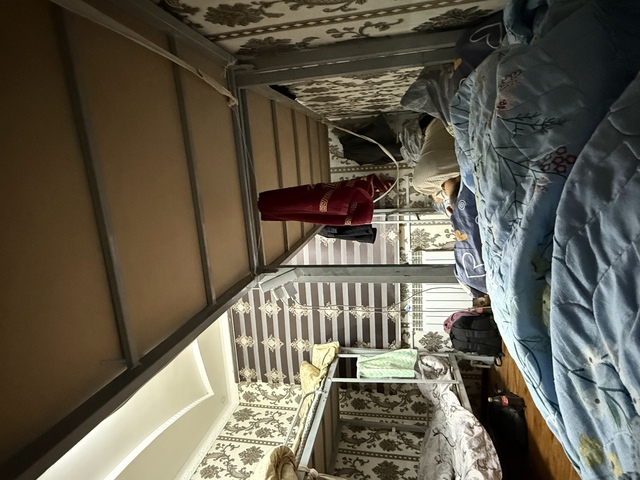

斜め上の若い兄ちゃんがよくしてくれて、インターネットがないと困るだろうと、スマホのテザリングをしてくれました。

さっそく、Telegramのグループを見てみると、16時頃にDurovさんがちょうどここから10kmくらい先のレストランで夜扉を叩いたら個室で寝られる、と情報を投げてくれていました。
ずっとネットがなかったので、見る機会がなかったのですが、やはり食堂は仮眠場所の選択肢なのですね。

明日は移動距離が少ないので6時に起きることにします。
23:30就寝です。

おやすみなさい。

3日目: 移動距離: 263km (計 840km)

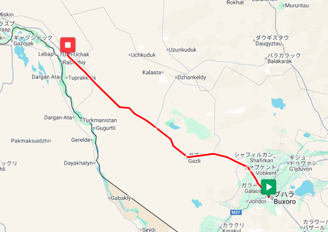
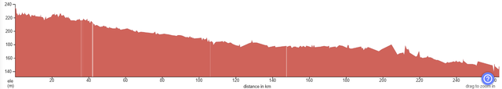
