## 今日の予定

5日目です。
朝5時に起床しました。
20:30頃寝たので、8時間半くらいたっぷり休みました。
ここから後半約1000kmは、基本的に昨日まで通った道を戻ります。

往路はここまで4日で来ましたが、復路は5日かけて戻る予定です。
人間は動き続けると疲れるのです。

今日は240km先のレストランを目指します。
おととい、往路で泊めてくれるか確認したあのレストランです。

## ヒバ: 1006km ～ 砂漠のレストラン: 1246km

朝食は8時からだそうで、このホテルもお弁当を作ってくれるそうです。
昨日もいた英語を話せる少年がお弁当を作ってくれました。

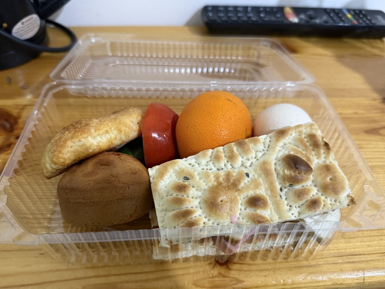

昨日洗濯して干してもらったものを取り入れると、手袋が片方ありませんでした。
あちこち探したのですが見つからなかったので諦めます。
一応手袋は2組あるので、大丈夫です。

お弁当を食べて、6時頃出発です。



城壁の中から外に出て、ルートに戻ります。
ここからは折り返しです。

昨日来た道を走ります。
早朝東に向かって走るので朝日が前から照らします。



記憶では、路面が悪くて大変苦労したのですが。。。

はい。一晩で路面がよくなるわけありませんよね。
こんな感じです。



しかし、昨日何度も空気圧を調整したので、このくらいの路面であれば、気にせず走れるようにはなっています。
一晩経ってさらに空気が抜けたのか、むしろ昨日より走りやすい気もします。

いつもなら、朝空気を足したりするのですが、今日はもう足しません。
このままのコンディションで快適に(?!)荒れた路面を突き進みます。

時刻は、朝7時半頃。
小さな町を通過しました。
朝市か何かでしょうか。
たくさんの人が集まっています。



町はいくつかありますが、あまり多くはないので、ここで何か買い物でもすればよかったかもですが、とりあえず、道のガタガタに飽きてるので、先を急ぎます。

とにかく、ガタガタしてるところを一生懸命走っているので、この間ほとんど写真もありません。

1時間ほど走って、小腹も空いてきたところでお店を見つけたので、食べ物を買っておきました。

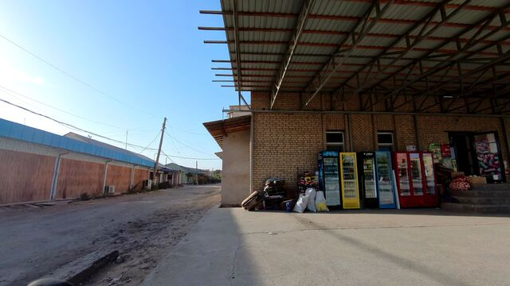

しばらく走っていると、遅いトラックに追いつきました。
追い越そうかと思ったのですが、速度が微妙です。



後ろを着いて走っていると、おやおや、これは快適です。
素晴らしい風よけです。
急いでいるわけでもないし、追い越すのはもったいないので、後ろを着いて行かせていただきました。
牽いていただいてありがとうございます！！！

しばらく行くと、バス停が見えてきたので、軽くご飯にします。

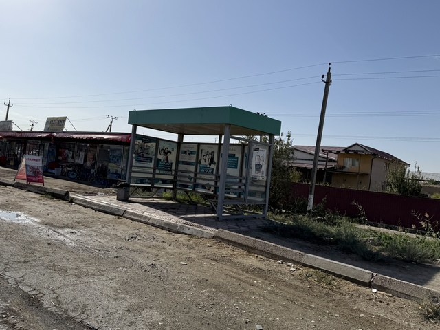

中に自転車を止めてこんな感じです。

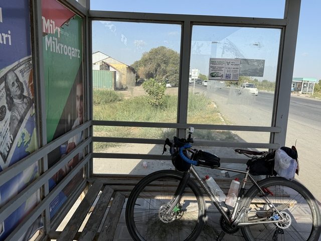

さっき買ったハムとパンを食べます。

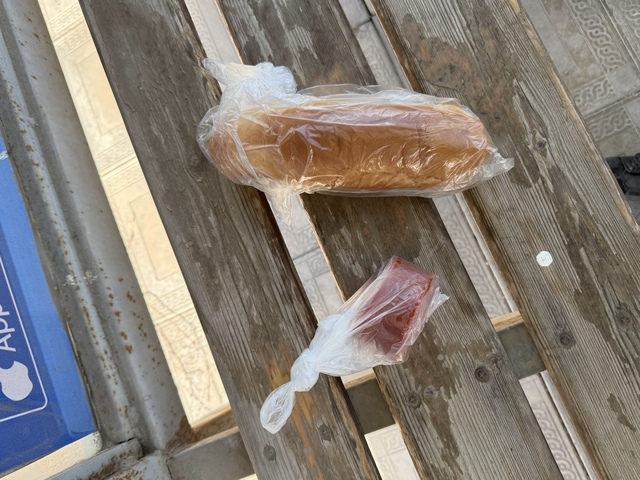

ハムは長さを指定したら切って量り売りしてくれます。

ちなみに、このハムは、「このパンに合うくらいの長さで」と頼んだものです。

さらに進んで、午前11時過ぎ。
80kmくらい来ました。

昨日、砂漠区間を抜けて最初に寄ったお店が出てきたので、飲み物などを補充します。

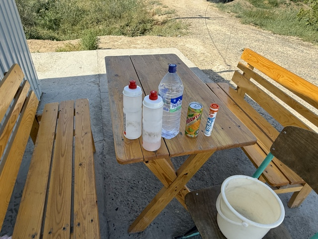

帰りはルートの様子をある程度知っているのでかなり安心です。
レストランやお店も少ないですが、ないわけではないのが分かっているので、もう心配していません。

昨日長い間待たされた橋のところまで来ました。

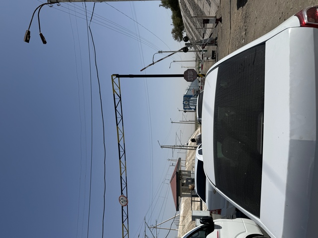

今日もまた待たされるのかと思ったら、対向車線の車が通り過ぎた後、すぐに通されました。
電車が来なければ、そんなに待たされることはないようです。

さて、砂漠区間の始まりです。

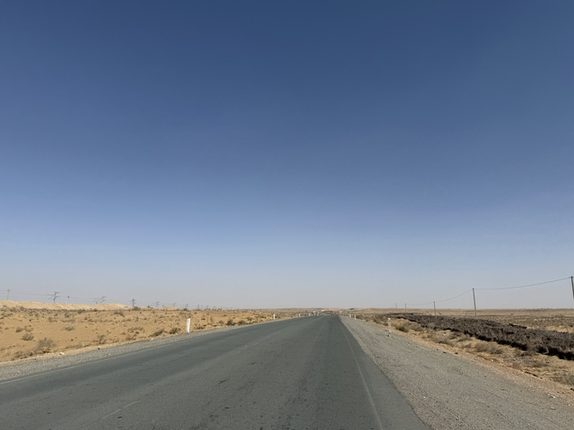

路面がいいので、非常に走りやすいです。
しかも、めちゃめちゃ追い風です。
このあと、15kmくらいで右折するので、そのあとは右からの横風なのでしょうか。

電車が通り過ぎていきました。

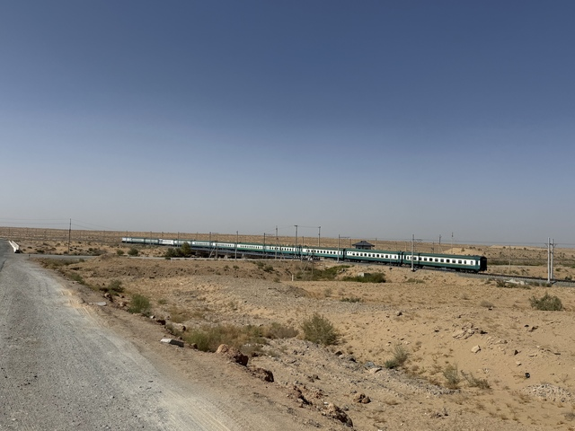

もう少し遅かったら、また、長い時間待たされていたようですね。

右折した後、予想通り右からの横風でしたが、若干追い風気味で向かい風ではなく助かりました。

時刻は12:30。
ちょうどいいところにレストランがありました。
寄っていくことにします。

メニューはないのかと聞くと、厨房まで連れて行ってくれました。

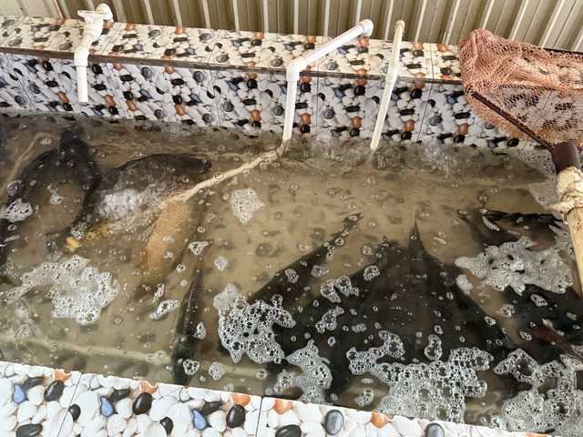

魚のお店だそうです。

こういう量り売り的なのは日本だと恐ろしく高いのですが、ここらへんでは普通の売り方のようで普通の価格で食べられます。

こんな感じになって出てきました。

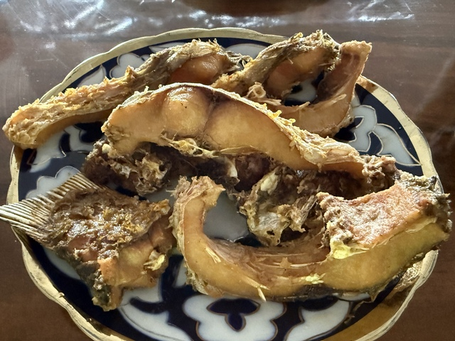

骨が多いですが、うまうまです。

パンもでてきますが、相変わらずでかいです。

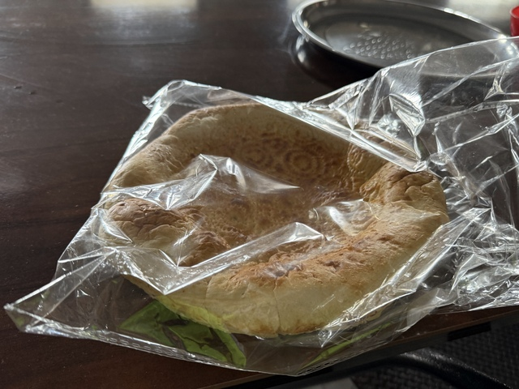

食事をして外に出ると、かなり砂っぽくなっていました。
横風なので、砂が巻き上がっているようです。

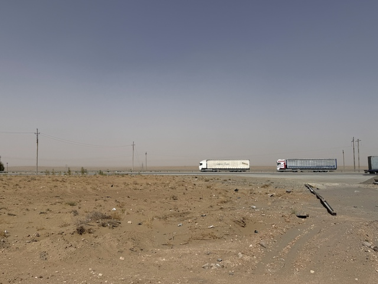

出発の用意をしていると、例によって人が集まってきました。

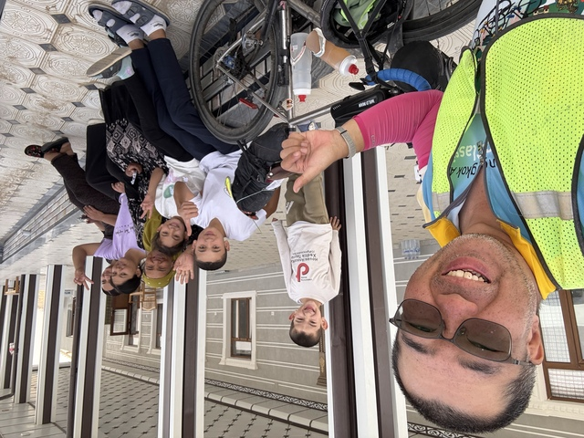

写真を撮ったり話したりしていると、梅干しの種ようなものをもらいました。
殻を割って中身を取り出して食べます。

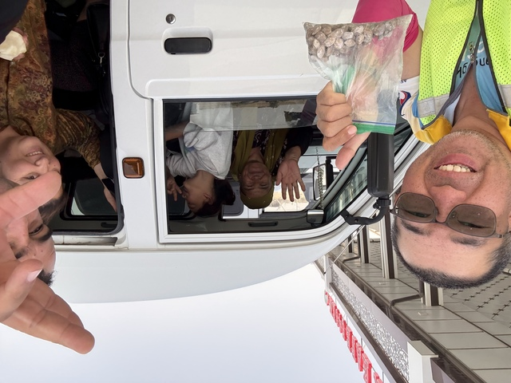

さて、出発です。
砂ぼこりがすごいので、ちょっとマスク的なものをしてみました。
暑いので途中ではずしましたが。。。

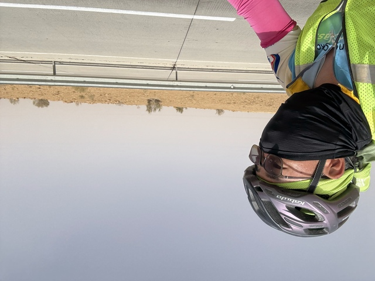

見慣れた何もない道を進みます。

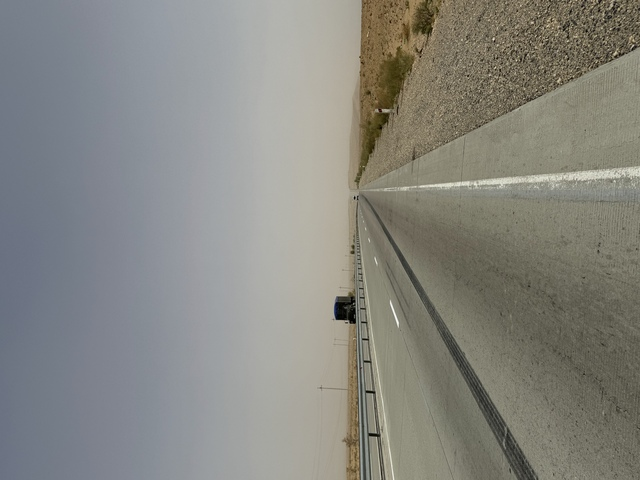

これは、雨が降ると水が溜まるのでしょうか。



ここの砂漠の道路沿いは、実はあまりきれいではなく、ゴミが散乱しています。
そのゴミを地元の集落の人たちが集めているようです。

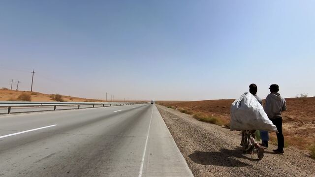

道路脇にはゴミだけではありません。
なぜか、パンクしてバーストしたタイヤがひっきりなしに落ちています。
夏は気温が高いからバーストするのでしょうか。

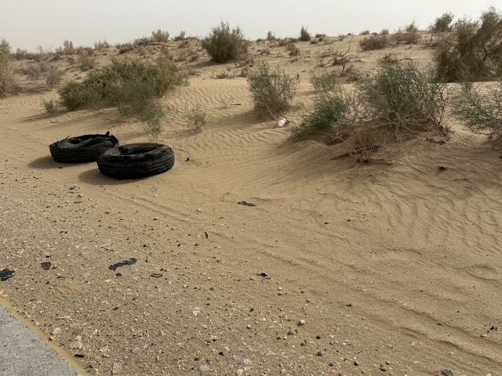

15:40、カフェがあったので休憩です。

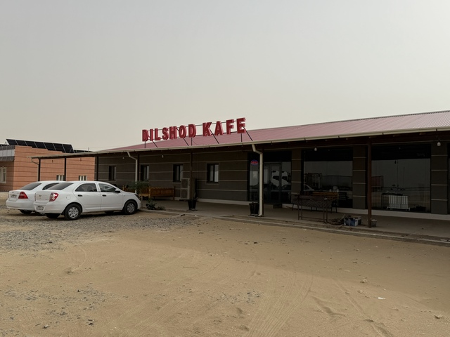

お腹は空いていないので、飲み物だけ調達します。

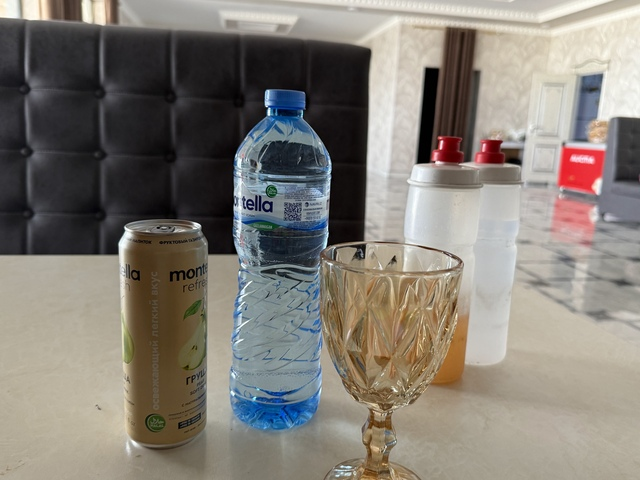

またしても、人がいっぱい集まってきました。

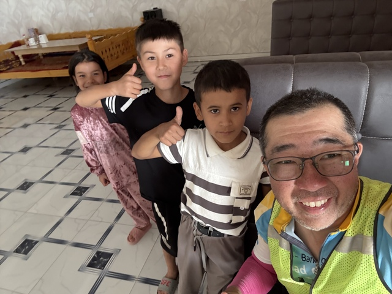

写真を撮ってくれるそうです。

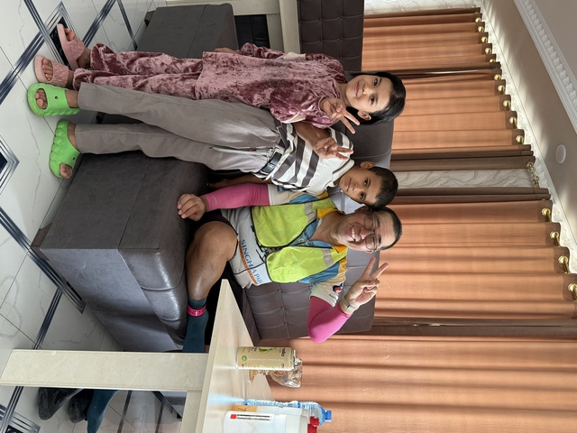

カメラマン交代です。

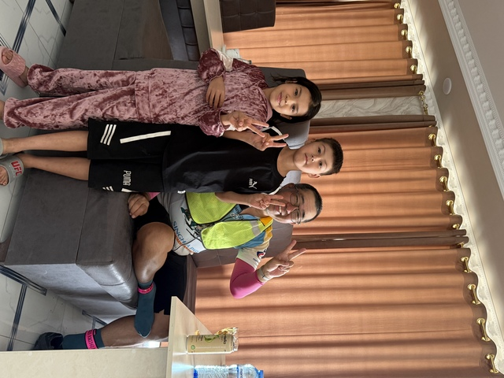

外に出ると、さらに砂っぽくなっていました。

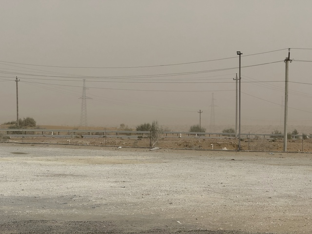

砂漠にたたずむトイレです。

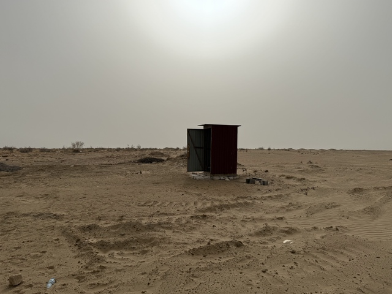

おとつい泊まったホテルのあたりまで戻って来ました。
このあたりで、170kmくらいです。

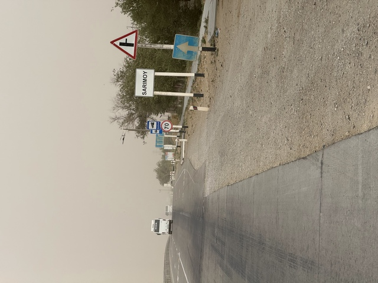

ガーミンが1200kmを超えたので、パチリ。
砂だらけですね。

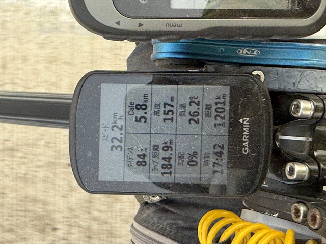

時刻は午後5時42分。
事前にGarminに登録したデータによると、5.8km先にCafeがあるらしいので、そこで晩ご飯にすることにします。

ということで到着です。

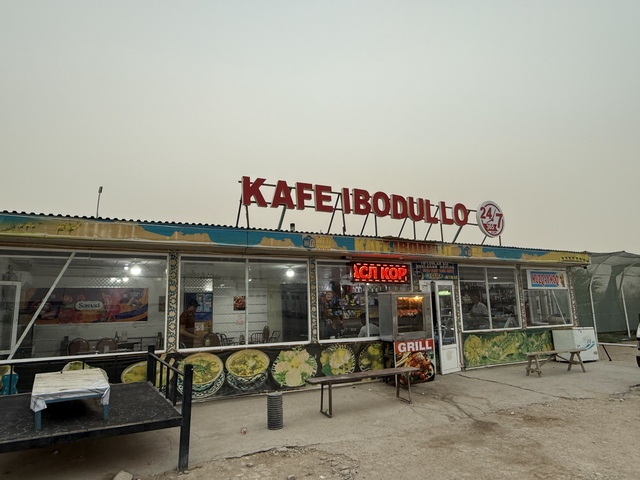

真夜中に砂漠を走っていないんですが、看板を信じるなら24時間営業のようで、意外と房総半島の内陸より食べるところがあるんではないかと思ってしまいます。

こんな写真付きのメニューは久しぶりな気がします。

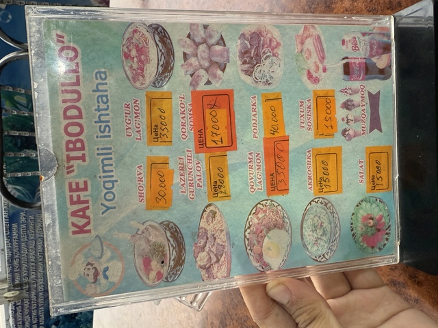

左上のShorvaと左の上から3番目のQovurma Lagmonを頼みました。
スープと焼きうどんみたいなのです。

しばらく待つと、出てきました！

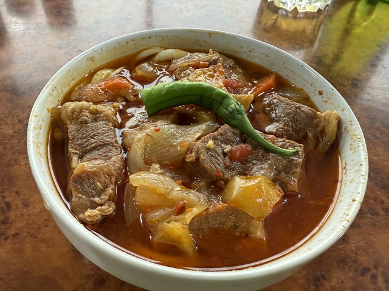

おいしそう！！！
実際、めちゃめちゃおいしいです。

が、しかし、底をまさぐってみると、

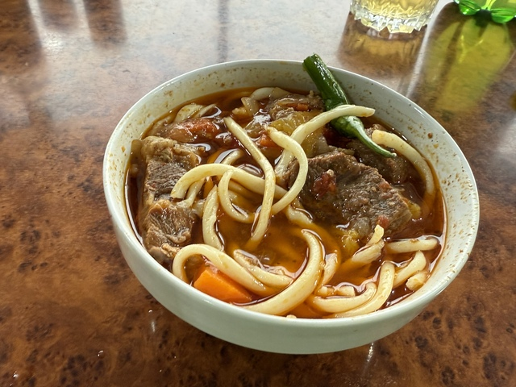

うどん入ってるやん。。。

と、思いながらおいしくいただいていると・・・来ましたよ。また、うどん。

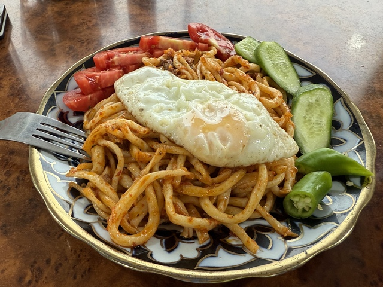

おなかいっぱいいただきました。

さて、あと50kmほどで今日の目的地のレストランです。

しばらく走ると、日が落ちて暗くなりました。
暗くなると、砂ぼこりがライトに照らされて、いかに砂だらけかということが分かります。



ライトに照らされている粒々は雨ではなく、ぜんぶ砂です。

ちなみに、Garminに表示されている、あと600mくらい先の「ohaka」はこれです。お墓です。

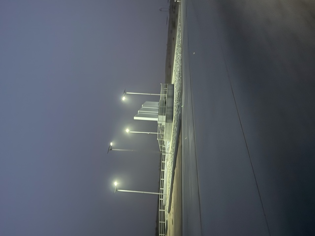

ガソリンスタンドの光が見えてきました。

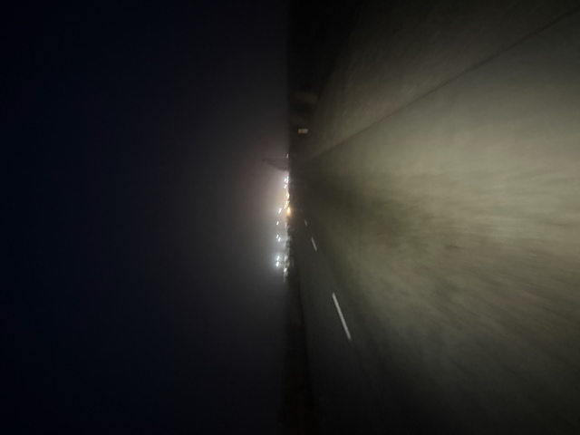

行きも立ち寄ったところです。対向車線ですが、少しだけ休憩していきます。

駐車場には謎の目がピカピカしているトラックがありました。



21:00ちょっと前くらい、無事レストランに到着です。

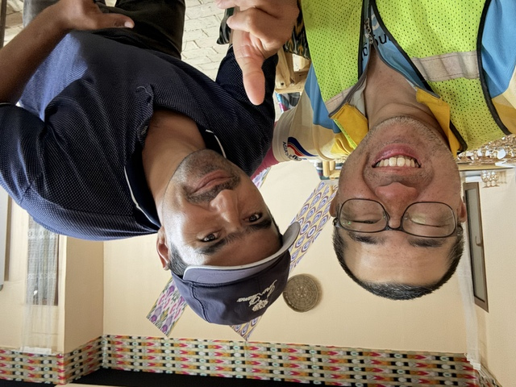

また、おしんの話を聞いて、かるく食事です。

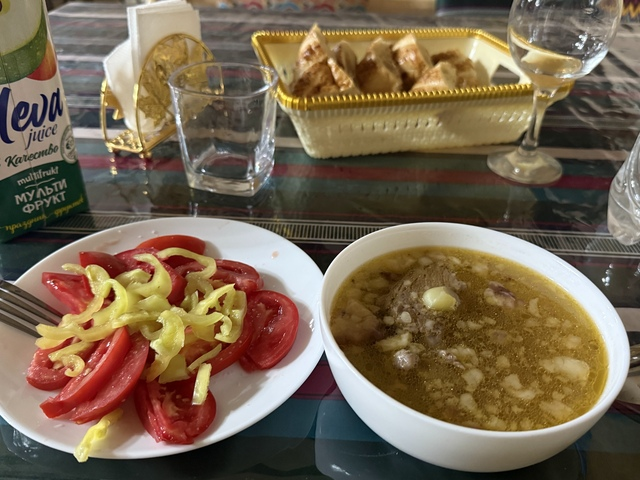

自転車も中に置かせてくれました。

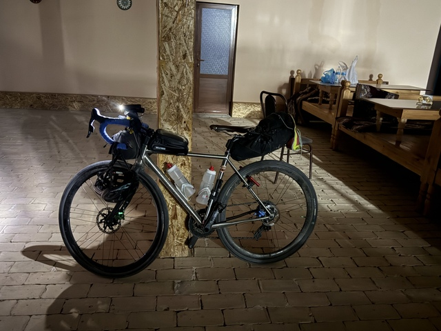

小上がりの長いマットを敷き布団と掛け布団にして簡易ベッドのできあがりです。

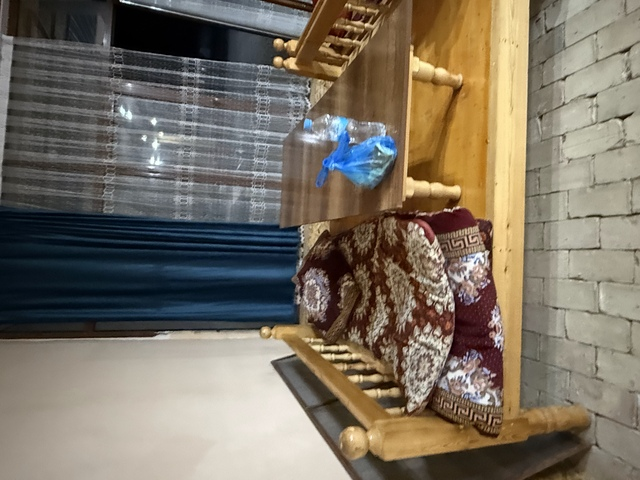

寒いのではないかと心配していたのですが、大丈夫でした。

こんな感じでおやすみです。

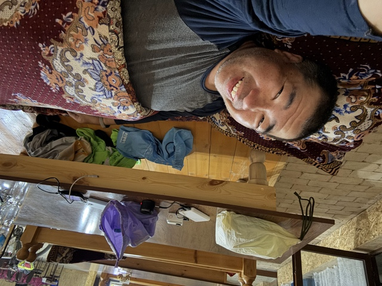

宿泊代は6万スム、約660円です。

僕が寝た後、少しガヤガヤしていて、夜中トイレに起きたときには、他に寝てる人もいたので、こういうレストラン(チャイハナ)で仮眠を取るのは一般的なようです。

ということで、22:10就寝です。
明日は5時に起きて出発します。

5日目: 移動距離: 240km (計 1246km)

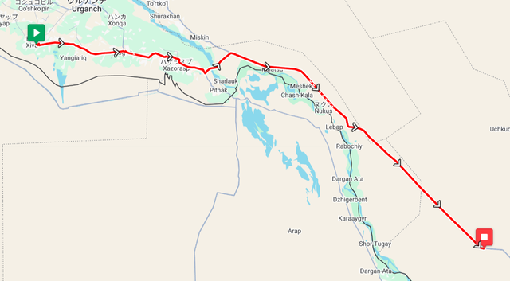
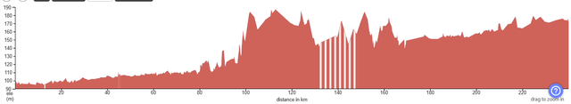
