## タイの犬について

タイは野犬が非常に多い国です。
とくに田舎に行くと、小さな集落を守るようにして野犬がたむろしています。
昼間は暑いせいかぐだーっとしているだけなのですが、夕方や夜間、早朝は彼らは元気で彼らのテリトリーから追い払おうとして襲ってきます。

基本的に、集落に住み着いている犬というような扱いで、特定の飼い主がいるわけでもなく、狂犬病の予防接種などは受けていません。

地域にもよりますが、タイを自転車で走っていると、とつぜん脇から犬が飛び出してきて追いかけられてびっくりする、というような経験を何度もすると思います。

ちなみに、噛まれたことはありませんが、たまに、サソリも歩いてたりします。

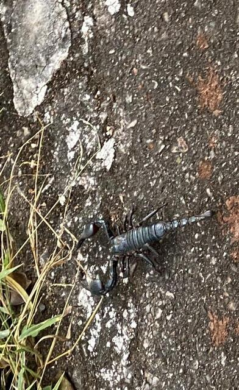

屋台ではおいしそうに売られています。

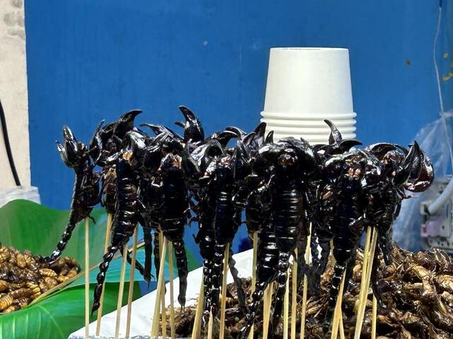

## タイの犬の特徴

- 最高速度 30km/h

    これ以上速く走ると着いて来れないようです。

- 自転車を後ろから追いかけてくる

- 足下より前には出ない

    つまり、15km/hでも後ろを着いてきます。
    急いで逃げる必要はありません。

- そのうち勝手にどっかに行く

    縄張りを過ぎると退散するようです。

- 威嚇してくるだけ (ただし、1匹の場合)

## 1度目の襲撃

2020年2月、2020kmのブルベを走っていました。
時刻は、日が落ちて少し経った頃、場所は、タイ北部、ラオスと国境を接する、ブンカーンからノンカーイへ向かう国道212号線で事件は起きました。

Pakkhatにホテルを取っていたので、そこまで残り30km程度、のんびりと走ってると、後ろから犬がやって来ました。どうも自転車が好きなようで、カサカサカサカサとすごい音を立てて追いかけてきます。

また、いつものように、適当に飽きたらどっかいくだろう、とそのままのペースで走っていました。 ふと、足下をみると、左右に1匹ずつ、2匹が追いかけてきています。 しかも、すぐ、足下まで来ています。 ペダルはクルクルクルクルクル回しているので、ぶつかりそうです。

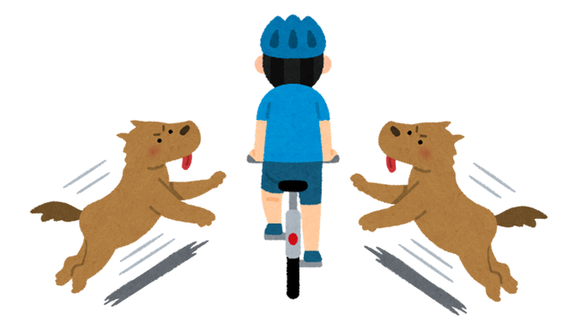

と、その瞬間、アウっと足に巻いていたアンクルバンドあたりをめがけてかぶりついてきました。

その後、ペダルに当たったのでしょうか。 キャっと言って去って行きました。

足には犬の口のにちゃっとした感覚が残っていました。

ホテルに到着して確認してみると、靴下に穴が空いていました。
幸い、足を噛まれることはなかったようです。

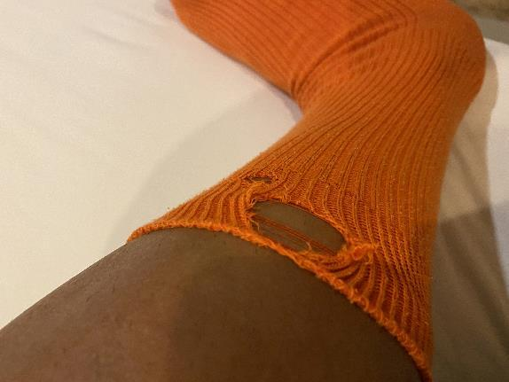

ひやーーーー。危なかったですね。

## 2度目の襲撃

2022年10月、今度は1200kmのブルベを走っていたときの話です。
バンコクから50km西に位置するナコンパトムを出発して、Tanaosriというタイの西側の山脈を一周し、ナコンパトムに戻ってくるコースです。
途中、舗装されていない国立公園の中の道を40km程走るコースとして知られています。

実はこの大会に出るのは2回目で、2017年にも開催されたのですが、この時は残念ながら国立公園を過ぎたところで時間がなくなりDNFしました。
今回は、そのリベンジです。

### 襲撃は突然に

今回も時間には追われていましたが、なんとか完走出来そうなペースで走ることができていました。
制限時刻は午前5時。それまでにナコンパトムのゴールに着くことができれば完走です。
ここまで走った距離は1150km、現在時刻は午後10時半、残り50kmを6時間半で走れば完走出来ます。
よほど、大きな問題が起きない限り、なんとかなるでしょう。

田舎道を快走していると、小さな町が見えてきました。

そんなとき、事件は起こります。

突然、左右から犬の集団が襲ってきました。
ま、よくあることではあるのですが、ちょっといつもとは様子が違います。
よく見てみると、左右に2匹以上が追いかけてきています。

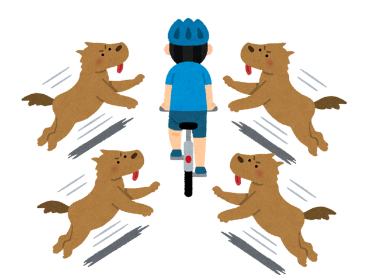

これは、ヤバイ。
と思ったときには時すでに遅く、左足のふくらはぎをガブリとやられました。

### 応急処置

ちょうど数百メートル先に7-11が見えたので、そこでまずどうするかを考えることにします。

まず、店員さんに近くに病院がないか尋ねましたがないそうです。
お店に来ていた他のお客さんたちも巻き込みながら、医者の友達がいる人に電話をしてもらって応急処置を聞いてもらいました。

とりあえず、水道水でよく洗って消毒液で消毒するといいそうなので、店員さんオススメの消毒液を購入しました。
たぶん、色的に赤チンだと思います。
とくに、病院に行け、とは言われませんでした。

言われたとおり、水道水でよく洗って、消毒して、ひとまず応急処置は完了です。

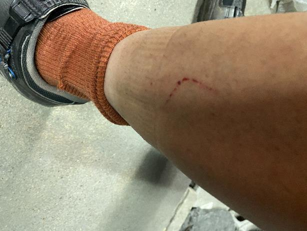

### 次にどうするか

ここにいても仕方がないので、ゴールを目指します。

とりあえず、大会のライングループがあったので、犬に噛まれたという報告と、ゴールに向かうという連絡を入れておきました。

大きな道に出て5km程走ると、対向車線側に大きな病院が見えてきました。

ゴールまではあと45km、残り時間はまだ5時間ちょいあります。

さて、どうする? 寄る? 寄らない?

45kmなので、3時間もあれば余裕で行けますが、病院が2時間で終わるかどうかよくわかりません。
もし、ここで時間を使い過ぎたらいままでの1150kmの努力は水の泡です。
7-11で電話してもらったお医者さんも病院に行けとは言ってませんでした。

道も走りやすいし、足も痛くないので、速ければ2時間くらいで着けそうです。
ということで、ゴールを目指しました。

### ゴール

ということで、無事ゴールすることができました。

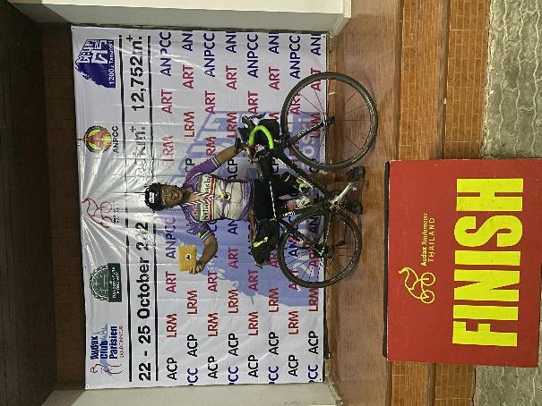

タイのブルベではゴールやチャックポイントで食事をよくふるまってくれます。
ここでも、食事があったので、おいしくいただいていました。

しばらくすると、スタッフの方が声をかけてきました。

    スタッフ「病院は行ったの?」
    僕     「明日バンコクに戻ったら行こうと思ってるよ」
    スタッフ「いやいや、それでは手遅れだ。
             車持ってる人に送らせるから、
             すぐに病院に行きなさい。」
    僕     「え゛っ、まじ?」

ということで、深夜3時、病院送りとなりました。

### 病院

タイの病院は薬局などに比べて高いので、タイ人はあまり行きません。
その代わり、過剰なくらいのサービスが提供されています。

連れて行ってもらったのは、ゴールの近くにあるナコンパトムのバンコク病院でした。

まず、入口に着くとスーパーのショッピングカートのように、50台くらいの車椅子が並べ慣れています。
ここで、まず、車椅子に座らせられます。

確かに、足を怪我してはいるのですが、50kmを自転車で走れるくらいには問題ありません。
そんなことをお構いなしに、サービスとして提供されます。

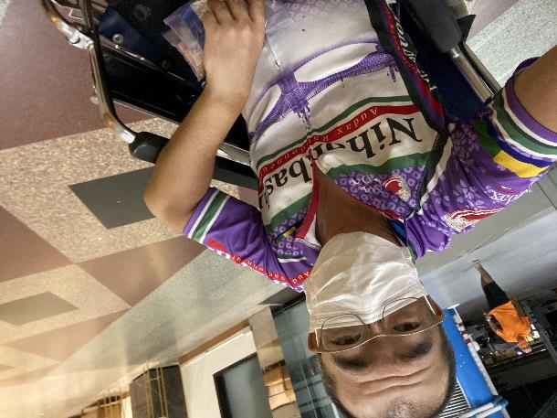

まず、診察を受けます。
真夜中ですが、担当のお医者さんがすぐに対応してくれました。
自転車に乗っていて犬に噛まれたこと、応急処置はしたこと、狂犬病ワクチンは打ったことがないことなどを話しました。

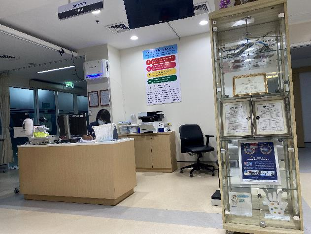

処方としては、

- 狂犬病ワクチンの注射
- HRIG(ヒト抗狂犬病免疫グロブリン)の注射
- 破傷風ワクチンの注射
- amoksiklav (感染症の薬)
- イブプロフェン

でした。

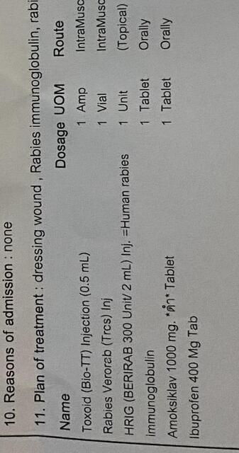

狂犬病のワクチンは効果が出るまで1週間ほどかかるため、HRIGというヒトの血液で作成した抗体を直接噛まれたところに注射します。

暴露前に狂犬病ワクチンを接種している場合は、このHRIGは不要で、ブースターとして狂犬病ワクチンを打つだけで問題ないそうで、次からはブースターだけで大丈夫ですよ、と言っていました。
HRIGは高価で病院によっては置いていないので、犬に噛まれる予定のある方は、あらかじめワクチンを接種しておいた方がいいかもしれません。
ちなみに、日本では狂犬病がないので置いていないそうです。

狂犬病ワクチンは、全部で5回接種します。
1回目を0日目として、3日目、7日目、14日目、28日目と、倍々の期間で接種します。

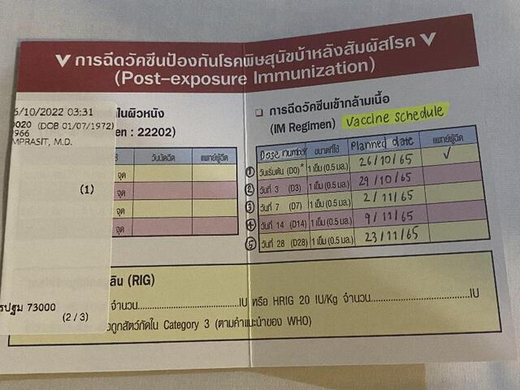

左腕(狂犬病ワクチン)

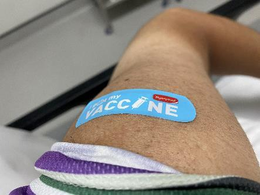

右腕(破傷風ワクチン)

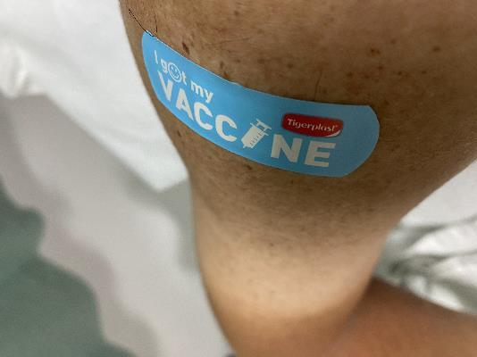

噛まれたところ (ヒト抗狂犬病免疫グロブリン)

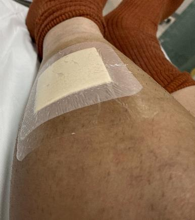

費用は、全部で7759バーツでした。

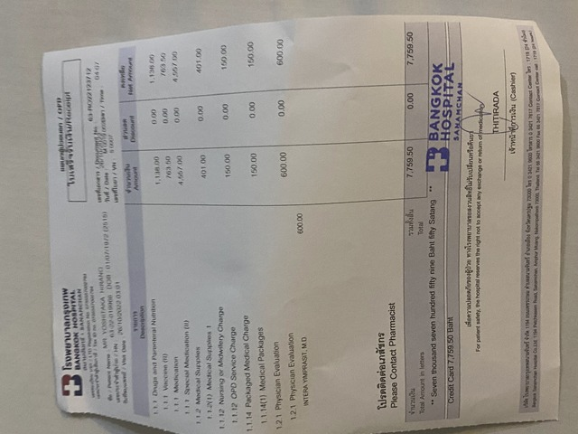

### バンコクでの治療

次の日ナコンパトムからバンコクに移動したので、バンコクのRama9病院に行って2回目のワクチンの予約を取りました。
ここの病院のサービスも素晴らしく、車椅子サービスはありませんでしたが、無料の日本語の通訳サービスがありました。

### 日本に帰ってから

7日目以降は日本で接種しました。
ネットで検索して、同じ種類のVerorabというワクチンを取り扱っているところを探しました。
麹町の、[グローバルヘルスケアクリニック](https://www.ghc.tokyo)というとこに取り扱いがあったので、ここで、7日目、14日目、28日めの接種をおこないました。

ワクチンは15000円+消費税で16500円と高価だったのですが、タイ、日本全ての治療費はクレジットカードの海外旅行保険でまかなえました。
